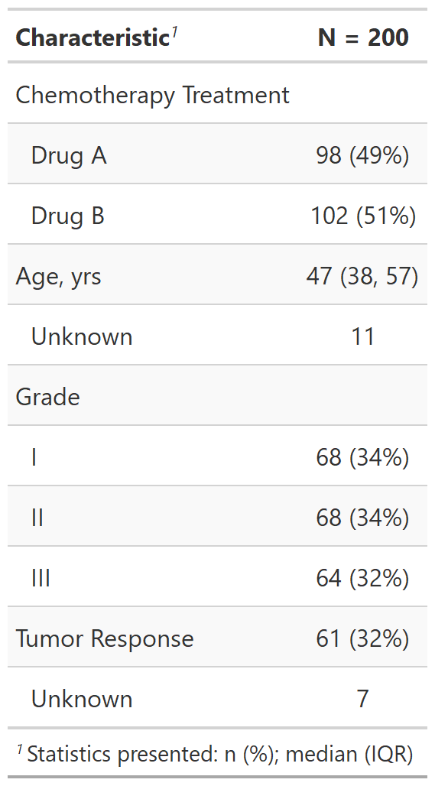
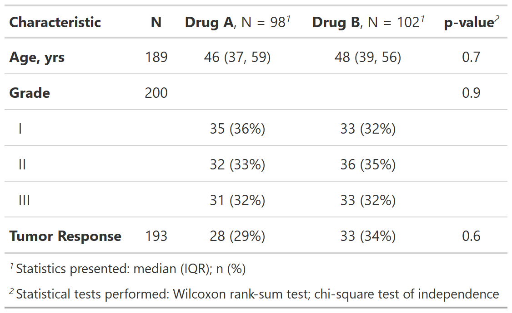
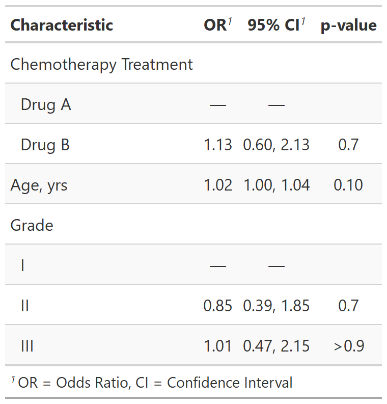
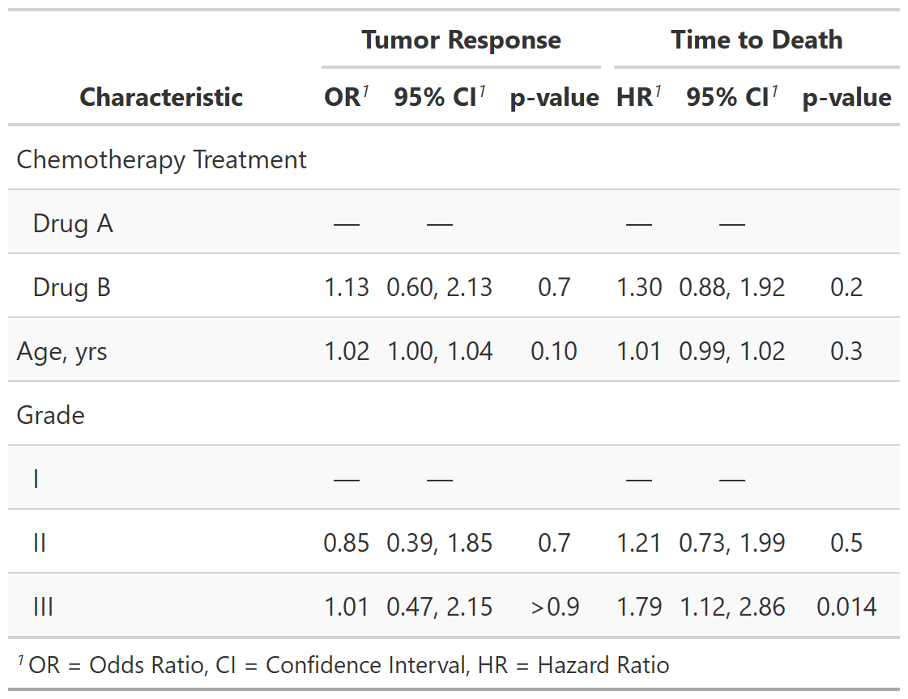

<!-- README.md is generated from README.Rmd. Please edit that file -->

```{r setup, include = FALSE}
knitr::opts_chunk$set(
  collapse = TRUE,
  comment = "#>",
  fig.path = "man/figures/README-",
  out.width = "100%"
)
```

<!-- badges: start -->
[](https://travis-ci.com/ddsjoberg/gtsummary)
[](https://ci.appveyor.com/project/ddsjoberg/gtsummary)
[](https://codecov.io/github/ddsjoberg/gtsummary?branch=master)
[](https://cran.r-project.org/package=gtsummary)
[](https://cran.r-project.org/package=gtsummary)
[](https://www.tidyverse.org/lifecycle/#maturing)
<!-- badges: end -->

## gtsummary <a href='https://github.com/ddsjoberg/gtsummary'></a>

The {gtsummary} package provides an elegant and flexible way to create publication-ready analytical and summary tables using the **R** programming language.  The {gtsummary} package summarizes data sets, regression models, and more, using sensible defaults with highly customizable capabilities.

* [**Summarize data frames or tibbles**](http://www.danieldsjoberg.com/gtsummary/articles/tbl_summary.html) easily in **R**. Perfect for presenting descriptive statistics, comparing group **demographics** (e.g creating a **Table 1** for medical journals),  and more. Automatically detects continuous, categorical, and dichotomous variables in your data set, calculates appropriate descriptive statistics, and also includes amount of missingness in each variable.

* [**Summarize regression models**](http://www.danieldsjoberg.com/gtsummary/articles/tbl_regression.html) in R and include reference rows for categorical variables. Common regression models, such as logistic regression and Cox proportional hazards regression, are automatically identified and the tables are pre-filled with appropriate column headers (i.e. Odds Ratio and Hazard Ratio). 

* [**Customize gtsummary tables**](http://www.danieldsjoberg.com/gtsummary/reference/index.html#section-general-formatting-styling-functions) using a growing list of formatting/styling functions. **[Bold](http://www.danieldsjoberg.com/gtsummary/reference/bold_italicize_labels_levels.html)** labels, **[italicize](http://www.danieldsjoberg.com/gtsummary/reference/bold_italicize_labels_levels.html)** levels, **[add p-value](http://www.danieldsjoberg.com/gtsummary/reference/add_p.html)** to summary tables, **[style](http://www.danieldsjoberg.com/gtsummary/reference/style_percent.html)** the statistics however you choose, **[merge](http://www.danieldsjoberg.com/gtsummary/reference/tbl_merge.html)** or **[stack](http://www.danieldsjoberg.com/gtsummary/reference/tbl_stack.html)** tables to present results side by side... there are so many possibilities to create the table of your dreams! 

* **[Report statistics inline](http://www.danieldsjoberg.com/gtsummary/articles/tbl_summary.html#inline_text)** from summary tables and regression summary tables in **R markdown**. Make your reports completely reproducible!


By leveraging [{broom}](https://broom.tidyverse.org/), [{gt}](https://gt.rstudio.com/), and [{labelled}](http://larmarange.github.io/labelled/) packages, {gtsummary} creates beautifully formatted, ready-to-share summary and result tables in a single line of R code!  

Check out the examples below, review the [vignettes](http://www.danieldsjoberg.com/gtsummary/articles/) for a detailed exploration of the output options, and view the [gallery](http://www.danieldsjoberg.com/gtsummary/articles/gallery.html) for various customization examples.


## Installation

The {gtsummary} package was written as a companion to the [{gt}](https://gt.rstudio.com/) package from RStudio, and it is recommended to install both {gt} and {gtsummary}.  The {gt} package is not automatically installed. If {gt} is not installed, `knitr::kable()` will be used to produce the summary tables.  You can install {gtsummary} and {gt} with the following code.  

1. Install {gtsummary}

    ``` r
    install.packages("gtsummary")
    ```

1. Install {gt} from GitHub (recommended)

    ``` r
    install.packages("remotes")
    remotes::install_github("rstudio/gt", ref = gtsummary::gt_sha)
    ```

Install the development version of {gtsummary} with:

``` r
remotes::install_github("ddsjoberg/gtsummary")
```

## Examples

### Summary Table

Use [`tbl_summary()`](http://www.danieldsjoberg.com/gtsummary/reference/tbl_summary.html) to summarize a data frame. 


Example basic table:

```{r table1, include = TRUE}
library(gtsummary)
# make dataset with a few variables to summarize
trial2 <- trial %>% dplyr::select(trt, age, grade, response)

# summarize the data with our package
table1 <- tbl_summary(trial2)
```

```{r tbl_summary_print_simple, include = FALSE}
# Had to manually save images in temp file, not sure if better way.
gt::gtsave(as_gt(table1), file = file.path(tempdir(), "temp.png"))
```


```{r out.width = "30%", echo = FALSE}
# Have to do this workaround since the README needs markdown format for GitHub page but a different format for the website.
if (pkgdown::in_pkgdown()) {
  table1
} else {
  
} 
```

There are many **customization options** to **add information** (like comparing groups) and **format results** (like bold labels) in your table. See the [`tbl_summary()`](http://www.danieldsjoberg.com/gtsummary/articles/tbl_summary.html) tutorial for many more options, or below for one example. 

```{r table2, include = TRUE}
table2 <- tbl_summary(
  trial2,
  by = trt, # split table by group
  missing = "no" # don't list missing data separately
) %>%
  add_n() %>% # add column with total number of non-missing observations
  add_p() %>% # test if there's difference between groups
  bold_labels() 

```

```{r tbl_summary_print_extra, include = FALSE}
gt::gtsave(as_gt(table2), file = file.path(tempdir(), "temp.png"))
```


```{r out.width = "60%", echo = FALSE}
if (pkgdown::in_pkgdown()) {
  table2
} else {
  
}
```

### Regression Models

Use [`tbl_regression()`](http://www.danieldsjoberg.com/gtsummary/reference/tbl_regression.html) to easily and beautifully display regression model results in a table. See the [tutorial](http://www.danieldsjoberg.com/gtsummary/articles/tbl_regression.html) for customization options.


```{r regress, include = TRUE}
mod1 <- glm(response ~ trt + age + grade, trial, family = binomial)

t1 <- tbl_regression(mod1, exponentiate = TRUE)
```

```{r tbl_regression_printa, include = FALSE}
gt::gtsave(as_gt(t1), file = file.path(tempdir(), "temp.png"))
```


```{r out.width = "40%", echo = FALSE}
if (pkgdown::in_pkgdown()) {
  t1
} else {
  
} 
```


### Side-by-side Regression Models

You can also present side-by-side regression model results using `tbl_merge()`

```{r}
library(survival)

# build survival model table
t2 <-
  coxph(Surv(ttdeath, death) ~ trt + grade + age, trial) %>%
  tbl_regression(exponentiate = TRUE)

# merge tables 
tbl_merge_ex1 <-
  tbl_merge(
    tbls = list(t1, t2),
    tab_spanner = c("**Tumor Response**", "**Time to Death**")
  )

```

```{r tbl_merge_ex1, include = FALSE}
gt::gtsave(as_gt(tbl_merge_ex1), file = file.path(tempdir(), "temp.png"))
```


```{r out.width = "60%", echo = FALSE}
if (pkgdown::in_pkgdown()) {
  t3
} else {
  
} 

```

Review even more output options in the [table gallery](http://www.danieldsjoberg.com/gtsummary/articles/gallery.html).

## Print Engine

{gtsummary} uses the {gt} package to print all summary tables.  In addition to supporting {gt}, the {gtsummary} package works well with `knitr::kable()`.  This is particularly useful when outputting documents to Microsoft Word.  If the {gt} package is not installed, {gtsummary} will fall back to `knitr::kable()`.  To explicitly set the printing engine, set the option in the script or in the user- or project R profile, `.Rprofile`.

    options(gtsummary.print_engine = "kable") 
    
or
    
    options(gtsummary.print_engine = "gt")

Output from {kable} is less full featured compared to summary tables produced with {gt}.  For example, {kable} summary tables do not include indentation, footnotes, and spanning header rows.

## Contributing

Please note that the {gtsummary} project is released with a [Contributor Code of Conduct](http://www.danieldsjoberg.com/gtsummary/CODE_OF_CONDUCT.html). By contributing to this project, you agree to abide by its terms. A big thank you to all contributors!  
`r usethis::use_tidy_thanks("ddsjoberg/gtsummary", from = "1970-01-01") %>% {glue::glue("[&#x0040;{.}](https://github.com/{.})")} %>% glue::glue_collapse(sep = ", ", last = ", and ")`

