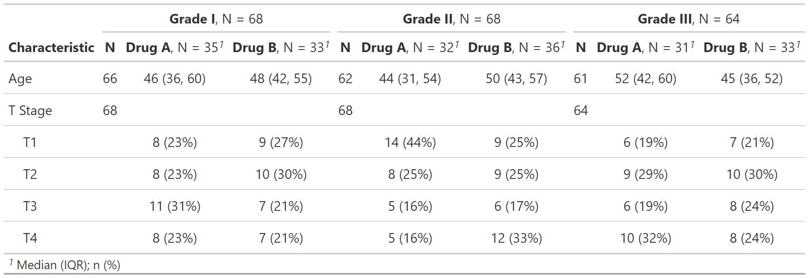

<!-- README.md is generated from README.Rmd. Please edit that file -->

```{r setup, include = FALSE}
knitr::opts_chunk$set(
  collapse = TRUE,
  comment = "#>",
  fig.path = "man/figures/README-",
  out.width = "100%"
)
```

<!-- badges: start -->
[](https://travis-ci.org/ddsjoberg/gtsummary)
[](https://ci.appveyor.com/project/ddsjoberg/gtsummary)
[](https://codecov.io/github/ddsjoberg/gtsummary?branch=master)
[](https://cran.r-project.org/package=gtsummary)
[](https://cran.r-project.org/package=gtsummary)
[](https://www.tidyverse.org/lifecycle/#maturing)
<!-- badges: end -->

## gtsummary <a href='https://github.com/ddsjoberg/gtsummary'></a>

The {gtsummary} package provides an elegant and flexible way to create publication-ready and reproducible analytical tables.  The tables summarize data sets, regression models, and more. The code is concise and the tables are highly customizable.  Data frames can be summarized with any function, e.g. mean(), median(), even user-written functions. Regression models are summarized and include the reference rows for categorical variables. Common regression models, such as logistic regression and Cox proportional hazards regression, are automatically identified and the tables are pre-filled with appropriate column headers (i.e. Odds Ratio, and Hazard Ratio). The package uses [{broom}](https://broom.tidyverse.org/) to perform initial tidying of the regression models, which means there is broad support for many types of regression models. 

{gtsummary} uses the [{gt}](https://gt.rstudio.com/) package enabling each table to be tailored to your preferences. If you label your data (which I recommend!), the labels will be used in the table output. With {gtsummary} and [{labelled}](http://larmarange.github.io/labelled/) data, you get beautifully formatted, ready-to-share tables in a single line of code!  Check out the examples below, and review the vignettes for a detailed exploration of the output options.

## Installation

The {gtsummary} package was written as a companion to the {gt} package from RStudio, and it is recommended to install both {gt} and {gtsummary}.  The {gt} package is not automatically installed. If {gt} is not installed, `knitr::kable()` will be used to produce the summary tables.  You can install {gtsummary} and {gt} with the following code.  

1. Install {gtsummary}

    ``` r
    install.packages("gtsummary")
    ```

1. Install {gt} from GitHub (recommended)

    ``` r
    install.packages("remotes")
    remotes::install_github("rstudio/gt")
    ```

Install the development version of {gtsummary} with:

``` r
remotes::install_github("ddsjoberg/gtsummary")
```

## Examples

The {gtsummary} vignettes/tutorials contain detailed examples.  

### Summary Table

```{r t1, include = TRUE}
library(gtsummary)
t1 <-
  tbl_summary(
    data = trial[c("trt", "age", "grade", "response")],
    by = trt
  ) %>%
  add_p() 
```

```{r tbl_summary_print, include = FALSE}
gt::gtsave(as_gt(t1), file = file.path(tempdir(), "temp.png"))
```


### Regression Models

```{r regress, include = TRUE}
mod1 <- glm(response ~ trt + age + grade, trial, family = binomial)

t2 <- tbl_regression(mod1, exponentiate = TRUE)
```

```{r tbl_regression_print, include = FALSE}
gt::gtsave(as_gt(t2), file = file.path(tempdir(), "temp.png"))
```


### Other Tables

Side-by-side regression model results from `tbl_merge()`


Survival Estimates from `tbl_survival()`



Review even more output options in the [table gallery](http://www.danieldsjoberg.com/gtsummary/articles/gallery.html).

## Print Engine

{gtsummary} uses the {gt} package to print all summary tables.  In addition to supporting {gt}, the {gtsummary} package works well with `knitr::kable()`.  This is particularly useful when outputting documents to Microsoft Word.  If the {gt} package is not installed, {gtsummary} will fall back to `knitr::kable()`.  To explicitly set the printing engine, set the option in the script or in the user- or project R profile, `.Rprofile`.

    options(gtsummary.print_engine = "kable") 
    
or
    
    options(gtsummary.print_engine = "gt")

Output from {kable} is less full featured compared to summary tables produced with {gt}.  For example, {kable} summary tables do not include indentation, footnotes, and spanning header rows.

## Contributing

Please note that the {gtsummary} project is released with a [Contributor Code of Conduct](http://www.danieldsjoberg.com/gtsummary/CODE_OF_CONDUCT.html). By contributing to this project, you agree to abide by its terms. A big thank you to all contributors!  
`r usethis::use_tidy_thanks(from = "1970-01-01") %>% {glue::glue("[&#x0040;{.}](https://github.com/{.})")} %>% glue::glue_collapse(sep = ", ", last = ", and ")`
