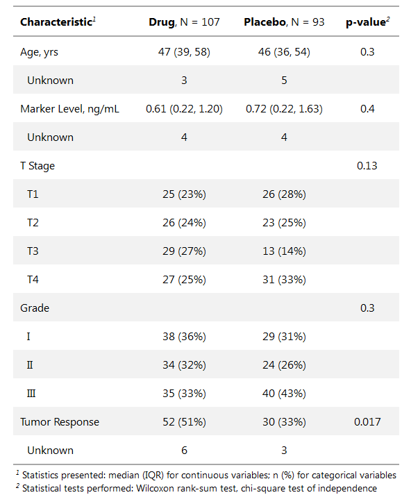
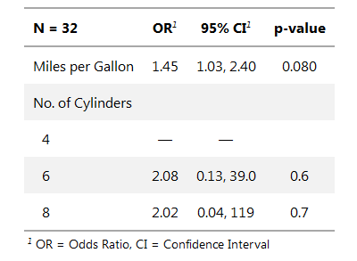

<!-- README.md is generated from README.Rmd. Please edit that file -->

<!-- badges: start -->

[](https://www.tidyverse.org/lifecycle/#experimental)
[](https://travis-ci.org/ddsjoberg/gtsummary)
[](https://ci.appveyor.com/project/ddsjoberg/gtsummary)
[](https://codecov.io/github/ddsjoberg/gtsummary?branch=master)
<!-- badges: end -->

## gtsummary

The {gtsummary} package creates presentation-ready tables summarizing
data sets, regression models, and more. The code to create the tables is
concise and highly customizable. The resulting tables are georgeous\!
Data frames can be summarized with any function, e.g. mean(), median(),
even user-written functions. Regression models are summarized and
include the reference row for categorical variables in the model. Common
regression models, such as logistic regression and Cox proportional
hazards regression, are automatically identified and the tables are
pre-filled with appropriate column headers (i.e. Odds Ratio, and Hazard
Ratio). The package uses [{broom}](https://broom.tidyverse.org/) to
perform initial tidying of the regression models, which means there is
broad support for many types of regression models.

{gtsummary} uses the [{gt}](https://gt.rstudio.com/) package enabling
each table to be tailored to your preferences. If you label your data
(which I recommend\!), the labels will be used in the table output. With
{gtsummary} and labelled data, you get a beautifully formatted,
ready-to-share table in a single line of code\! Check out the examples
below, and review the vignettes for a detailed exploration of the output
options.

## Installation

You can install the production version of {gtsummary} with:

``` r
install.packages("remotes")
remotes::install_github("ddsjoberg/gtsummary")
```

and the development version with:

``` r
remotes::install_github("ddsjoberg/gtsummary", ref = "dev")
```

## Examples

The vignettes/tutorials for {gtsummary} functions have detailed examples
and can be found at
[danieldsjoberg.com/gtsummary](http://www.danieldsjoberg.com/gtsummary).

### Summary Table

``` r
library(gtsummary)
#> Loading required package: gt
t1 <-
  tbl_summary(
    data = trial[c("trt", "age", "grade", "response")],
    by = "trt"
  ) %>%
  add_comparison() 
```

<!-- { width=65% } -->


### Regression Models

``` r
mod1 <- 
  glm(response ~ trt + age + grade, trial, family = binomial(link = "logit"))
t2 <-
  tbl_regression(mod1,
                 exponentiate = TRUE)
```

<!-- { width=47% } -->


Please note that the {gtsummary} project is released with a [Contributor
Code of Conduct](.github/CODE_OF_CONDUCT.md). By contributing to this
project, you agree to abide by its terms. A big thank you to all
contributors\!  
<!-- UPDATE THIS LIST! usethis::use_tidy_thanks() -->
[@ddsjoberg](https://github.com/ddsjoberg),
[@karissawhiting](https://github.com/karissawhiting), and
[@michaelcurry1123](https://github.com/michaelcurry1123)
