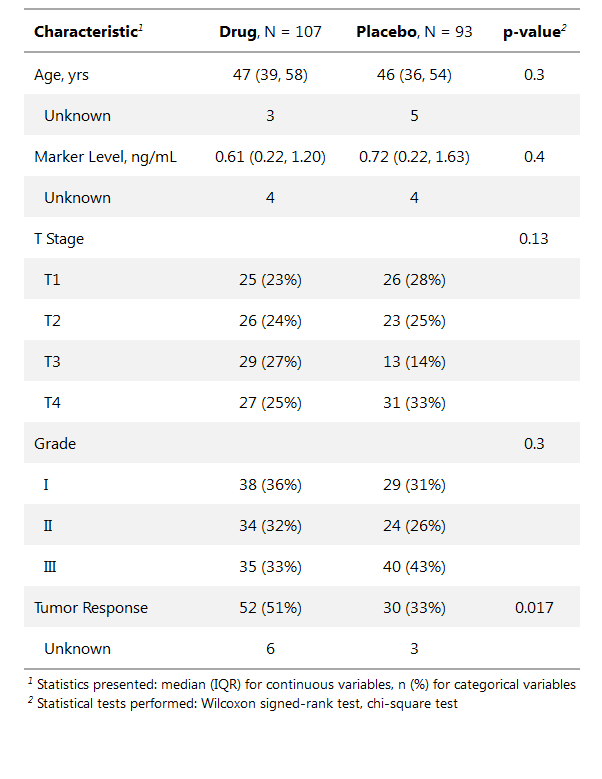

<!-- README.md is generated from README.Rmd. Please edit that file -->
<!-- [](https://www.tidyverse.org/lifecycle/#experimental) -->
[](https://travis-ci.org/ddsjoberg/gtsummary) [](https://ci.appveyor.com/project/ddsjoberg/gtsummary) [](https://codecov.io/github/ddsjoberg/gtsummary?branch=master)

gtsummary
---------

A collection of functions commonly used in the work of the biostatisticians. The goal of gtsummary is to make reporting of tabular analytic results simple, beautiful, and reproducible.
<!-- Update the list of contributors from the git shell `git shortlog -s -n` -->

Installation
------------

You can install the production version of gtsummary with:

``` r
install.packages("remotes")
remotes::install_github("ddsjoberg/gtsummary")
```

and the development version with:

``` r
remotes::install_github("ddsjoberg/gtsummary", ref = "dev")
```

Examples
--------

The vignettes/tutorials for the primary gtsummary functions have detailed examples and can be found at [danieldsjoberg.com/gtsummary](http://www.danieldsjoberg.com/gtsummary). Each vignette is an Rmarkdown file (\*.Rmd) and a copy of the files can be found here: <https://github.com/ddsjoberg/gtsummary/tree/master/vignettes>.

### Summary Table

``` r
library(gtsummary)
#> Loading required package: gt
t1 <-
  tbl_summary(trial, by = "trt") %>% 
  add_comparison() 
```



### Regression Models

``` r
mod1 = glm(am ~ mpg + factor(cyl), mtcars, family = binomial(link = "logit"))
tbl_regression(
  mod1, exponentiate = TRUE, 
  label = list(`factor(cyl)` = "No. of Cylinders", mpg = "Miles per Gallon")
)
```

<!--html_preserve-->
<style>html {
  font-family: -apple-system, BlinkMacSystemFont, 'Segoe UI', Roboto, Oxygen, Ubuntu, Cantarell, 'Fira Sans', 'Droid Sans', 'Helvetica Neue', Arial, sans-serif;
}

#ebtctjzkic .gt_table {
  display: table;
  border-collapse: collapse;
  margin-left: auto;
  margin-right: auto;
  color: #000000;
  font-size: 16px;
  background-color: #FFFFFF;
  /* table.background.color */
  width: auto;
  /* table.width */
  border-top-style: solid;
  /* table.border.top.style */
  border-top-width: 2px;
  /* table.border.top.width */
  border-top-color: #A8A8A8;
  /* table.border.top.color */
}

#ebtctjzkic .gt_heading {
  background-color: #FFFFFF;
  /* heading.background.color */
  border-bottom-color: #FFFFFF;
}

#ebtctjzkic .gt_title {
  color: #000000;
  font-size: 125%;
  /* heading.title.font.size */
  padding-top: 4px;
  /* heading.top.padding */
  padding-bottom: 1px;
  border-bottom-color: #FFFFFF;
  border-bottom-width: 0;
}

#ebtctjzkic .gt_subtitle {
  color: #000000;
  font-size: 85%;
  /* heading.subtitle.font.size */
  padding-top: 1px;
  padding-bottom: 4px;
  /* heading.bottom.padding */
  border-top-color: #FFFFFF;
  border-top-width: 0;
}

#ebtctjzkic .gt_bottom_border {
  border-bottom-style: solid;
  /* heading.border.bottom.style */
  border-bottom-width: 2px;
  /* heading.border.bottom.width */
  border-bottom-color: #A8A8A8;
  /* heading.border.bottom.color */
}

#ebtctjzkic .gt_column_spanner {
  border-bottom-style: solid;
  border-bottom-width: 2px;
  border-bottom-color: #A8A8A8;
  padding-top: 4px;
  padding-bottom: 4px;
}

#ebtctjzkic .gt_col_heading {
  color: #000000;
  background-color: #FFFFFF;
  /* column_labels.background.color */
  font-size: 16px;
  /* column_labels.font.size */
  font-weight: initial;
  /* column_labels.font.weight */
  vertical-align: middle;
  padding: 10px;
  margin: 10px;
}

#ebtctjzkic .gt_sep_right {
  border-right: 5px solid #FFFFFF;
}

#ebtctjzkic .gt_group_heading {
  padding: 8px;
  color: #000000;
  background-color: #FFFFFF;
  /* stub_group.background.color */
  font-size: 16px;
  /* stub_group.font.size */
  font-weight: initial;
  /* stub_group.font.weight */
  border-top-style: solid;
  /* stub_group.border.top.style */
  border-top-width: 2px;
  /* stub_group.border.top.width */
  border-top-color: #A8A8A8;
  /* stub_group.border.top.color */
  border-bottom-style: solid;
  /* stub_group.border.bottom.style */
  border-bottom-width: 2px;
  /* stub_group.border.bottom.width */
  border-bottom-color: #A8A8A8;
  /* stub_group.border.bottom.color */
  vertical-align: middle;
}

#ebtctjzkic .gt_empty_group_heading {
  padding: 0.5px;
  color: #000000;
  background-color: #FFFFFF;
  /* stub_group.background.color */
  font-size: 16px;
  /* stub_group.font.size */
  font-weight: initial;
  /* stub_group.font.weight */
  border-top-style: solid;
  /* stub_group.border.top.style */
  border-top-width: 2px;
  /* stub_group.border.top.width */
  border-top-color: #A8A8A8;
  /* stub_group.border.top.color */
  border-bottom-style: solid;
  /* stub_group.border.bottom.style */
  border-bottom-width: 2px;
  /* stub_group.border.bottom.width */
  border-bottom-color: #A8A8A8;
  /* stub_group.border.bottom.color */
  vertical-align: middle;
}

#ebtctjzkic .gt_striped tr:nth-child(even) {
  background-color: #f2f2f2;
}

#ebtctjzkic .gt_row {
  padding: 10px;
  /* row.padding */
  margin: 10px;
  vertical-align: middle;
}

#ebtctjzkic .gt_stub {
  border-right-style: solid;
  border-right-width: 2px;
  border-right-color: #A8A8A8;
  padding-left: 12px;
}

#ebtctjzkic .gt_stub.gt_row {
  background-color: #FFFFFF;
}

#ebtctjzkic .gt_summary_row {
  background-color: #FFFFFF;
  /* summary_row.background.color */
  padding: 6px;
  /* summary_row.padding */
  text-transform: inherit;
  /* summary_row.text_transform */
}

#ebtctjzkic .gt_first_summary_row {
  border-top-style: solid;
  border-top-width: 2px;
  border-top-color: #A8A8A8;
}

#ebtctjzkic .gt_table_body {
  border-top-style: solid;
  /* field.border.top.style */
  border-top-width: 2px;
  /* field.border.top.width */
  border-top-color: #A8A8A8;
  /* field.border.top.color */
  border-bottom-style: solid;
  /* field.border.bottom.style */
  border-bottom-width: 2px;
  /* field.border.bottom.width */
  border-bottom-color: #A8A8A8;
  /* field.border.bottom.color */
}

#ebtctjzkic .gt_footnote {
  font-size: 90%;
  /* footnote.font.size */
  padding: 4px;
  /* footnote.padding */
}

#ebtctjzkic .gt_sourcenote {
  font-size: 90%;
  /* sourcenote.font.size */
  padding: 4px;
  /* sourcenote.padding */
}

#ebtctjzkic .gt_center {
  text-align: center;
}

#ebtctjzkic .gt_left {
  text-align: left;
}

#ebtctjzkic .gt_right {
  text-align: right;
  font-variant-numeric: tabular-nums;
}

#ebtctjzkic .gt_font_normal {
  font-weight: normal;
}

#ebtctjzkic .gt_font_bold {
  font-weight: bold;
}

#ebtctjzkic .gt_font_italic {
  font-style: italic;
}

#ebtctjzkic .gt_super {
  font-size: 65%;
}

#ebtctjzkic .gt_footnote_glyph {
  font-style: italic;
  font-size: 65%;
}
</style>
<!--gt table start-->
<table class="gt_table">
<tr>
<th class="gt_col_heading gt_left" rowspan="1" colspan="1">
<strong>N = 32</strong>
</th>
<th class="gt_col_heading gt_center" rowspan="1" colspan="1">
<strong>OR</strong><sup class='gt_footnote_glyph'>1</sup>
</th>
<th class="gt_col_heading gt_center" rowspan="1" colspan="1">
<strong>95% CI</strong><sup class='gt_footnote_glyph'>1</sup>
</th>
<th class="gt_col_heading gt_center" rowspan="1" colspan="1">
<strong>p-value</strong>
</th>
</tr>
<tbody class="gt_table_body gt_striped">
<tr>
<td class="gt_row gt_left">
Miles per Gallon
</td>
<td class="gt_row gt_center">
1.45
</td>
<td class="gt_row gt_center">
1.03, 2.40
</td>
<td class="gt_row gt_center">
0.080
</td>
</tr>
<tr>
<td class="gt_row gt_left">
No. of Cylinders
</td>
<td class="gt_row gt_center">
</td>
<td class="gt_row gt_center">
</td>
<td class="gt_row gt_center">
</td>
</tr>
<tr>
<td class="gt_row gt_left" style="text-align:left;text-indent:10px;">
4
</td>
<td class="gt_row gt_center">
—
</td>
<td class="gt_row gt_center">
—
</td>
<td class="gt_row gt_center">
</td>
</tr>
<tr>
<td class="gt_row gt_left" style="text-align:left;text-indent:10px;">
6
</td>
<td class="gt_row gt_center">
2.08
</td>
<td class="gt_row gt_center">
0.13, 39.0
</td>
<td class="gt_row gt_center">
0.6
</td>
</tr>
<tr>
<td class="gt_row gt_left" style="text-align:left;text-indent:10px;">
8
</td>
<td class="gt_row gt_center">
2.02
</td>
<td class="gt_row gt_center">
0.04, 119
</td>
<td class="gt_row gt_center">
0.7
</td>
</tr>
</tbody>
<tfoot>
<tr>
<td colspan="4" class="gt_footnote">
<sup class='gt_footnote_glyph'><em>1</em></sup> OR = Odds Ratio, CI = Confidence Interval
</td>
</tr>
</tfoot>
</table>
<!--gt table end-->

<!--/html_preserve-->
