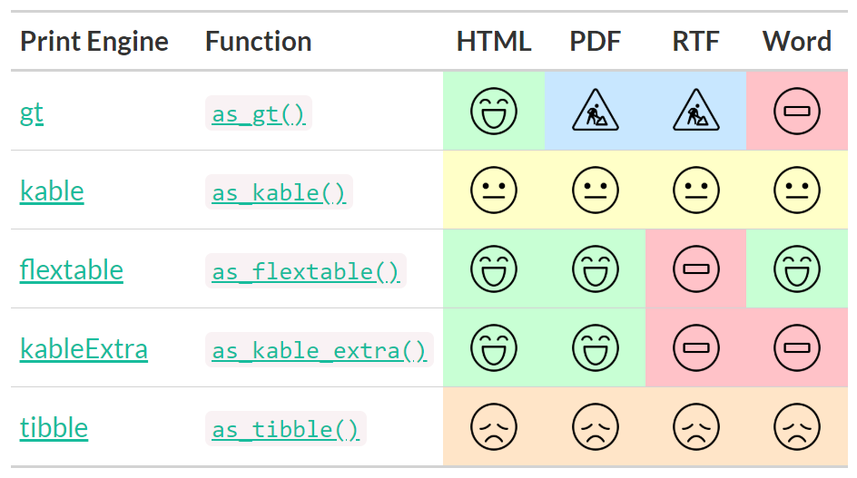

<!-- README.md is generated from README.Rmd. Please edit that file -->
<!-- badges: start -->

[](https://github.com/ddsjoberg/gtsummary/actions)
[](https://cran.r-project.org/package=gtsummary)
[](https://app.codecov.io/gh/ddsjoberg/gtsummary?branch=main)
[](https://cran.r-project.org/package=gtsummary)
[](https://doi.org/10.32614/RJ-2021-053)
<!-- badges: end -->

## gtsummary <a href='https://github.com/ddsjoberg/gtsummary'></a>

The {gtsummary} package provides an elegant and flexible way to create
publication-ready analytical and summary tables using the **R**
programming language. The {gtsummary} package summarizes data sets,
regression models, and more, using sensible defaults with highly
customizable capabilities.

- [**Summarize data frames or
  tibbles**](https://www.danieldsjoberg.com/gtsummary/articles/tbl_summary.html)
  easily in **R**. Perfect for presenting descriptive statistics,
  comparing group **demographics** (e.g creating a **Table 1** for
  medical journals), and more. Automatically detects continuous,
  categorical, and dichotomous variables in your data set, calculates
  appropriate descriptive statistics, and also includes amount of
  missingness in each variable.

- [**Summarize regression
  models**](https://www.danieldsjoberg.com/gtsummary/articles/tbl_regression.html)
  in R and include reference rows for categorical variables. Common
  regression models, such as logistic regression and Cox proportional
  hazards regression, are automatically identified and the tables are
  pre-filled with appropriate column headers (i.e. Odds Ratio and Hazard
  Ratio).

- [**Customize gtsummary
  tables**](https://www.danieldsjoberg.com/gtsummary/reference/index.html#section-general-formatting-styling-functions)
  using a growing list of formatting/styling functions.
  **[Bold](https://www.danieldsjoberg.com/gtsummary/reference/bold_italicize_labels_levels.html)**
  labels,
  **[italicize](https://www.danieldsjoberg.com/gtsummary/reference/bold_italicize_labels_levels.html)**
  levels, **[add
  p-value](https://www.danieldsjoberg.com/gtsummary/reference/add_p.html)**
  to summary tables,
  **[style](https://www.danieldsjoberg.com/gtsummary/reference/style_percent.html)**
  the statistics however you choose,
  **[merge](https://www.danieldsjoberg.com/gtsummary/reference/tbl_merge.html)**
  or
  **[stack](https://www.danieldsjoberg.com/gtsummary/reference/tbl_stack.html)**
  tables to present results side by side… there are so many
  possibilities to create the table of your dreams!

- **[Report statistics
  inline](https://www.danieldsjoberg.com/gtsummary/articles/inline_text.html)**
  from summary tables and regression summary tables in **R markdown**.
  Make your reports completely reproducible!

By leveraging [{broom}](https://broom.tidymodels.org/),
[{gt}](https://gt.rstudio.com/), and
[{labelled}](http://larmarange.github.io/labelled/) packages,
{gtsummary} creates beautifully formatted, ready-to-share summary and
result tables in a single line of R code!

Check out the examples below, review the
[vignettes](https://www.danieldsjoberg.com/gtsummary/articles/) for a
detailed exploration of the output options, and view the
[gallery](https://www.danieldsjoberg.com/gtsummary/articles/gallery.html)
for various customization examples.

## Installation

The {gtsummary} package was written as a companion to the
[{gt}](https://gt.rstudio.com/) package from RStudio. You can install
{gtsummary} with the following code.

``` r
install.packages("gtsummary")
```

Install the development version of {gtsummary} with:

``` r
remotes::install_github("ddsjoberg/gtsummary")
```

## Examples

### Summary Table

Use
[`tbl_summary()`](https://www.danieldsjoberg.com/gtsummary/reference/tbl_summary.html)
to summarize a data frame.


Example basic table:

``` r
library(gtsummary)

# summarize the data with our package
table1 <- 
  trial %>%
  tbl_summary(include = c(age, grade, response))
```


There are many **customization options** to **add information** (like
comparing groups) and **format results** (like bold labels) in your
table. See the
[`tbl_summary()`](https://www.danieldsjoberg.com/gtsummary/articles/tbl_summary.html)
tutorial for many more options, or below for one example.

``` r
table2 <-
  tbl_summary(
    trial,
    include = c(age, grade, response),
    by = trt, # split table by group
    missing = "no" # don't list missing data separately
  ) %>%
  add_n() %>% # add column with total number of non-missing observations
  add_p() %>% # test for a difference between groups
  modify_header(label = "**Variable**") %>% # update the column header
  bold_labels()
```


### Regression Models

Use
[`tbl_regression()`](https://www.danieldsjoberg.com/gtsummary/reference/tbl_regression.html)
to easily and beautifully display regression model results in a table.
See the
[tutorial](https://www.danieldsjoberg.com/gtsummary/articles/tbl_regression.html)
for customization options.

``` r
mod1 <- glm(response ~ trt + age + grade, trial, family = binomial)

t1 <- tbl_regression(mod1, exponentiate = TRUE)
```


### Side-by-side Regression Models

You can also present side-by-side regression model results using
`tbl_merge()`

``` r
library(survival)

# build survival model table
t2 <-
  coxph(Surv(ttdeath, death) ~ trt + grade + age, trial) %>%
  tbl_regression(exponentiate = TRUE)

# merge tables
tbl_merge_ex1 <-
  tbl_merge(
    tbls = list(t1, t2),
    tab_spanner = c("**Tumor Response**", "**Time to Death**")
  )
```


Review even more output options in the **[table
gallery](https://www.danieldsjoberg.com/gtsummary/articles/gallery.html)**.

## gtsummary + R Markdown

The **{gtsummary}** package was written to be a companion to the
**{gt}** package from RStudio. But not all output types are supported by
the **{gt}** package. Therefore, we have made it possible to print
**{gtsummary}** tables with various engines.

Review the **[gtsummary + R
Markdown](https://www.danieldsjoberg.com/gtsummary/articles/rmarkdown.html)**
vignette for details.

<a href="https://www.danieldsjoberg.com/gtsummary/articles/rmarkdown.html">
 </a>

## Save Individual Tables

{gtsummary} tables can also be saved directly to file as an image, HTML,
Word, RTF, and LaTeX file.

``` r
tbl %>%
  as_gt() %>%
  gt::gtsave(filename = ".") # use extensions .png, .html, .docx, .rtf, .tex, .ltx
```

## Additional Resources

- The best resources are the gtsummary vignettes: [table
  gallery](https://www.danieldsjoberg.com/gtsummary/articles/gallery.html),
  [`tbl_summary()`
  tutorial](https://www.danieldsjoberg.com/gtsummary/articles/tbl_summary.html),
  [`tbl_regression()`
  tutorial](https://www.danieldsjoberg.com/gtsummary/articles/tbl_regression.html),
  [`inline_text()`
  tutorial](https://www.danieldsjoberg.com/gtsummary/articles/inline_text.html),
  [gtsummary
  themes](https://www.danieldsjoberg.com/gtsummary/articles/themes.html),
  [gtsummary+R
  markdown](https://www.danieldsjoberg.com/gtsummary/articles/rmarkdown.html).

- The R Journal Article [*Reproducible Summary Tables with the gtsummary
  Package*](https://github.com/ddsjoberg/gtsummary/raw/main/data-raw/RJ-2021-053.pdf).

- The [RStudio Education
  Blog](https://education.rstudio.com/blog/2020/07/gtsummary/) includes
  a post with a brief introduction to the package.

- A [recording of a
  presentation](https://www.youtube.com/watch?v=tANo9E1SYJE) given to
  the Weill Cornell Biostatistics Department and the Memorial Sloan
  Kettering R Users Group.

  <iframe width="560" height="315" src="https://www.youtube.com/embed/tANo9E1SYJE" title="YouTube video player" frameborder="0" allow="accelerometer; clipboard-write; encrypted-media; gyroscope; picture-in-picture" allowfullscreen></iframe>

## Cite gtsummary

``` text
> citation("gtsummary")

To cite gtsummary in publications use:

  Sjoberg DD, Whiting K, Curry M, Lavery JA, Larmarange J. Reproducible summary tables with the gtsummary package.
  The R Journal 2021;13:570–80. https://doi.org/10.32614/RJ-2021-053.

A BibTeX entry for LaTeX users is

  @Article{gtsummary,
    author = {Daniel D. Sjoberg and Karissa Whiting and Michael Curry and Jessica A. Lavery and Joseph Larmarange},
    title = {Reproducible Summary Tables with the gtsummary Package},
    journal = {{The R Journal}},
    year = {2021},
    url = {https://doi.org/10.32614/RJ-2021-053},
    doi = {10.32614/RJ-2021-053},
    volume = {13},
    issue = {1},
    pages = {570-580},
  }
```

## Contributing

Big thank you to
[@jeffreybears](https://www.etsy.com/shop/jeffreybears/) for the hex
sticker!

Please note that the {gtsummary} project is released with a [Contributor
Code of
Conduct](https://www.danieldsjoberg.com/gtsummary/CODE_OF_CONDUCT.html).
By contributing to this project, you agree to abide by its terms. Thank
you to all contributors!
