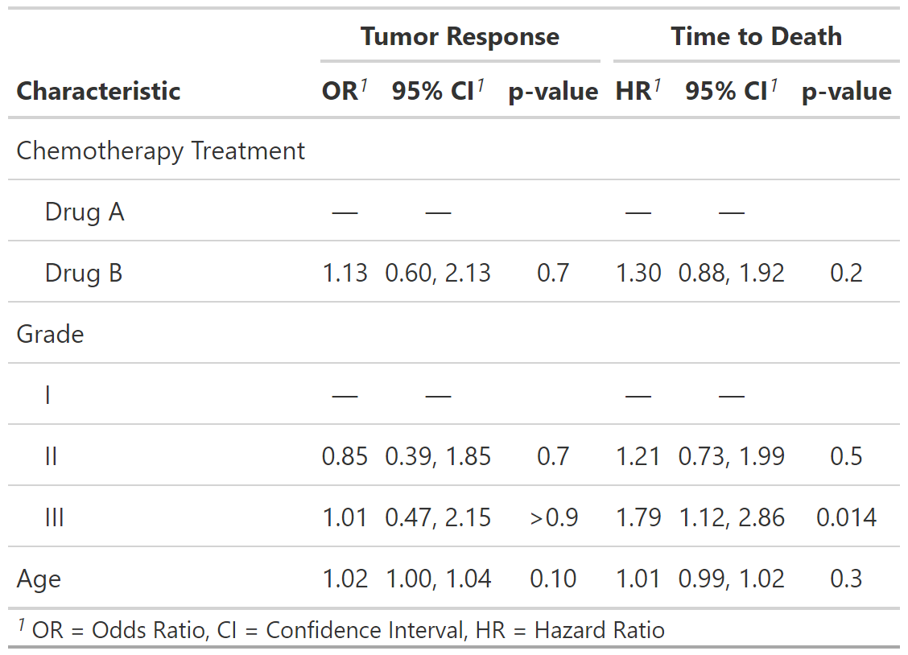

<!-- README.md is generated from README.Rmd. Please edit that file -->

<!-- badges: start -->

[](https://travis-ci.org/ddsjoberg/gtsummary)
[](https://ci.appveyor.com/project/ddsjoberg/gtsummary)
[](https://codecov.io/github/ddsjoberg/gtsummary?branch=master)
[](https://cran.r-project.org/package=gtsummary)
[](https://cran.r-project.org/package=gtsummary)
[](https://www.tidyverse.org/lifecycle/#maturing)
<!-- badges: end -->

## gtsummary <a href='https://github.com/ddsjoberg/gtsummary'></a>

The {gtsummary} package provides an elegant, flexible, concise way to
create publication-ready and reproducible analytical and summary tables
using the **R** programming language. The {gtsummary} package summarizes
data sets, regression models, and more, using sensible defaults with
highly customizable capabilities to present results.

  - [Summarize **data frames or
    tibbles**](http://www.danieldsjoberg.com/gtsummary/articles/tbl_summary.html)
    easily. Perfect for creating a **Table 1** in **R**, comparing group
    demographics, and more. Detects continuous, categorical, and binary
    variables, calculates appropriate descriptive statistics, and also
    includes amount of missingness in each variable.

  - [Summarize **regression
    models**](http://www.danieldsjoberg.com/gtsummary/articles/tbl_regression.html)
    and include reference rows for categorical variables. Common
    regression models, such as logistic regression and Cox proportional
    hazards regression, are automatically identified and the tables are
    pre-filled with appropriate column headers (i.e. Odds Ratio, and
    Hazard Ratio).

  - [**Customize gtsummary
    tables**](http://www.danieldsjoberg.com/gtsummary/reference/index.html#section-general-formatting-styling-functions)
    using a growing list of formatting/styling functions.
    **[Bold](http://www.danieldsjoberg.com/gtsummary/reference/bold_italicize_labels_levels.html)**
    labels,
    **[italicize](http://www.danieldsjoberg.com/gtsummary/reference/bold_italicize_labels_levels.html)**
    levels, **[add
    p-value](http://www.danieldsjoberg.com/gtsummary/reference/add_p.html)**
    to summary tables,
    **[style](http://www.danieldsjoberg.com/gtsummary/reference/style_percent.html)**
    the statistics however you choose,
    **[merge](http://www.danieldsjoberg.com/gtsummary/reference/tbl_merge.html)**
    or
    **[stack](http://www.danieldsjoberg.com/gtsummary/reference/tbl_stack.html)**
    tables to present results side by side… there are so many
    possibilities to reproducibly create the table of your dreams\!

  - **[Report statistics
    inline](http://www.danieldsjoberg.com/gtsummary/articles/tbl_summary.html#inline_text)**
    from summary tables and regression summary tables in **Rmarkdown**.
    Make your reports completely reproducible\!

By leveraging [{broom}](https://broom.tidyverse.org/),
[{gt}](https://gt.rstudio.com/), and
[{labelled}](http://larmarange.github.io/labelled/) packages,
{gtsummary} creates beautifully formatted, ready-to-share summary and
result tables in a single line of R code\!

Check out the examples below, review the
[vignettes](http://www.danieldsjoberg.com/gtsummary/articles/) for a
detailed exploration of the output options, and view the
[gallery](http://www.danieldsjoberg.com/gtsummary/articles/gallery.html)
for various customization examples.

## Installation

The {gtsummary} package was written as a companion to the {gt} package
from RStudio, and it is recommended to install both {gt} and
{gtsummary}. The {gt} package is not automatically installed. If {gt} is
not installed, `knitr::kable()` will be used to produce the summary
tables. You can install {gtsummary} and {gt} with the following code.

1.  Install {gtsummary}
    
    ``` r
    install.packages("gtsummary")
    ```

2.  Install {gt} from GitHub (recommended)
    
    ``` r
    install.packages("remotes")
    remotes::install_github("rstudio/gt")
    ```

Install the development version of {gtsummary} with:

``` r
remotes::install_github("ddsjoberg/gtsummary")
```

## Examples

### Summary Table

Basic usage will present descriptive statistics of your data.

``` r
library(gtsummary)

# make dataset with a few variables to summarize
trial2 <- trial[c("trt", "age", "grade", "response")]

# summarize the data with our package
tbl_summary(trial2)
```

<!--html_preserve-->

<style>html {
  font-family: -apple-system, BlinkMacSystemFont, 'Segoe UI', Roboto, Oxygen, Ubuntu, Cantarell, 'Helvetica Neue', 'Fira Sans', 'Droid Sans', Arial, sans-serif;
}

#dmmyeiddsc .gt_table {
  display: table;
  border-collapse: collapse;
  margin-left: auto;
  /* table.margin.left */
  margin-right: auto;
  /* table.margin.right */
  color: #333333;
  font-size: 16px;
  /* table.font.size */
  background-color: #FFFFFF;
  /* table.background.color */
  width: auto;
  /* table.width */
  border-top-style: solid;
  /* table.border.top.style */
  border-top-width: 2px;
  /* table.border.top.width */
  border-top-color: #A8A8A8;
  /* table.border.top.color */
  border-bottom-style: solid;
  /* table.border.bottom.style */
  border-bottom-width: 2px;
  /* table.border.bottom.width */
  border-bottom-color: #A8A8A8;
  /* table.border.bottom.color */
}

#dmmyeiddsc .gt_heading {
  background-color: #FFFFFF;
  /* heading.background.color */
  border-bottom-color: #FFFFFF;
  /* table.background.color */
  border-left-style: hidden;
  /* heading.border.lr.style */
  border-left-width: 1px;
  /* heading.border.lr.width */
  border-left-color: #D3D3D3;
  /* heading.border.lr.color */
  border-right-style: hidden;
  /* heading.border.lr.style */
  border-right-width: 1px;
  /* heading.border.lr.width */
  border-right-color: #D3D3D3;
  /* heading.border.lr.color */
}

#dmmyeiddsc .gt_title {
  color: #333333;
  font-size: 125%;
  /* heading.title.font.size */
  font-weight: initial;
  /* heading.title.font.weight */
  padding-top: 4px;
  /* heading.top.padding - not yet used */
  padding-bottom: 4px;
  border-bottom-color: #FFFFFF;
  /* table.background.color */
  border-bottom-width: 0;
}

#dmmyeiddsc .gt_subtitle {
  color: #333333;
  font-size: 85%;
  /* heading.subtitle.font.size */
  font-weight: initial;
  /* heading.subtitle.font.weight */
  padding-top: 0;
  padding-bottom: 4px;
  /* heading.bottom.padding - not yet used */
  border-top-color: #FFFFFF;
  /* table.background.color */
  border-top-width: 0;
}

#dmmyeiddsc .gt_bottom_border {
  border-bottom-style: solid;
  /* heading.border.bottom.style */
  border-bottom-width: 2px;
  /* heading.border.bottom.width */
  border-bottom-color: #D3D3D3;
  /* heading.border.bottom.color */
}

#dmmyeiddsc .gt_column_spanner {
  border-bottom-style: solid;
  border-bottom-width: 2px;
  border-bottom-color: #D3D3D3;
  padding-top: 4px;
  padding-bottom: 4px;
}

#dmmyeiddsc .gt_col_headings {
  border-top-style: solid;
  /* column_labels.border.top.style */
  border-top-width: 2px;
  /* column_labels.border.top.width */
  border-top-color: #D3D3D3;
  /* column_labels.border.top.color */
  border-bottom-style: solid;
  /* column_labels.border.bottom.style */
  border-bottom-width: 2px;
  /* column_labels.border.bottom.width */
  border-bottom-color: #D3D3D3;
  /* column_labels.border.bottom.color */
  border-left-style: none;
  /* column_labels.border.lr.style */
  border-left-width: 1px;
  /* column_labels.border.lr.width */
  border-left-color: #D3D3D3;
  /* column_labels.border.lr.color */
  border-right-style: none;
  /* column_labels.border.lr.style */
  border-right-width: 1px;
  /* column_labels.border.lr.width */
  border-right-color: #D3D3D3;
  /* column_labels.border.lr.color */
}

#dmmyeiddsc .gt_col_heading {
  color: #333333;
  background-color: #FFFFFF;
  /* column_labels.background.color */
  font-size: 100%;
  /* column_labels.font.size */
  font-weight: initial;
  /* column_labels.font.weight */
  text-transform: inherit;
  /* column_labels.text_transform */
  vertical-align: middle;
  padding: 5px;
  margin: 10px;
  overflow-x: hidden;
}

#dmmyeiddsc .gt_sep_right {
  border-right: 5px solid #FFFFFF;
}

#dmmyeiddsc .gt_group_heading {
  padding: 8px;
  /* row_group.padding */
  color: #333333;
  background-color: #FFFFFF;
  /* row_group.background.color */
  font-size: 100%;
  /* row_group.font.size */
  font-weight: initial;
  /* row_group.font.weight */
  text-transform: inherit;
  /* row_group.text_transform */
  border-top-style: solid;
  /* row_group.border.top.style */
  border-top-width: 2px;
  /* row_group.border.top.width */
  border-top-color: #D3D3D3;
  /* row_group.border.top.color */
  border-bottom-style: solid;
  /* row_group.border.bottom.style */
  border-bottom-width: 2px;
  /* row_group.border.bottom.width */
  border-bottom-color: #D3D3D3;
  /* row_group.border.bottom.color */
  border-left-style: none;
  /* row_group.border.left.style */
  border-left-width: 1px;
  /* row_group.border.left.width */
  border-left-color: #D3D3D3;
  /* row_group.border.left.color */
  border-right-style: none;
  /* row_group.border.right.style */
  border-right-width: 1px;
  /* row_group.border.right.width */
  border-right-color: #D3D3D3;
  /* row_group.border.right.color */
  vertical-align: middle;
}

#dmmyeiddsc .gt_empty_group_heading {
  padding: 0.5px;
  color: #333333;
  background-color: #FFFFFF;
  /* row_group.background.color */
  font-size: 100%;
  /* row_group.font.size */
  font-weight: initial;
  /* row_group.font.weight */
  border-top-style: solid;
  /* row_group.border.top.style */
  border-top-width: 2px;
  /* row_group.border.top.width */
  border-top-color: #D3D3D3;
  /* row_group.border.top.color */
  border-bottom-style: solid;
  /* row_group.border.bottom.style */
  border-bottom-width: 2px;
  /* row_group.border.bottom.width */
  border-bottom-color: #D3D3D3;
  /* row_group.border.bottom.color */
  vertical-align: middle;
}

#dmmyeiddsc .gt_striped {
  background-color: rgba(128, 128, 128, 0.05);
  /* row.striping.background_color */
}

#dmmyeiddsc .gt_from_md > :first-child {
  margin-top: 0;
}

#dmmyeiddsc .gt_from_md > :last-child {
  margin-bottom: 0;
}

#dmmyeiddsc .gt_row {
  padding-top: 8px;
  /* data_row.padding */
  padding-bottom: 8px;
  /* data_row.padding */
  padding-left: 5px;
  padding-right: 5px;
  margin: 10px;
  border-top-style: solid;
  /* table_body.hlines.style */
  border-top-width: 1px;
  /* table_body.hlines.width */
  border-top-color: #D3D3D3;
  /* table_body.hlines.color */
  border-left-style: none;
  /* table_body.vlines.style */
  border-left-width: 1px;
  /* table_body.vlines.width */
  border-left-color: #D3D3D3;
  /* table_body.vlines.color */
  border-right-style: none;
  /* table_body.vlines.style */
  border-right-width: 1px;
  /* table_body.vlines.width */
  border-right-color: #D3D3D3;
  /* table_body.vlines.color */
  vertical-align: middle;
  overflow-x: hidden;
}

#dmmyeiddsc .gt_stub {
  color: #333333;
  background-color: #FFFFFF;
  /* stub.background.color */
  font-weight: initial;
  /* stub.font.weight */
  text-transform: inherit;
  /* stub.text_transform */
  border-right-style: solid;
  /* stub.border.style */
  border-right-width: 2px;
  /* stub.border.width */
  border-right-color: #D3D3D3;
  /* stub.border.color */
  padding-left: 12px;
}

#dmmyeiddsc .gt_summary_row {
  color: #333333;
  background-color: #FFFFFF;
  /* summary_row.background.color */
  text-transform: inherit;
  /* summary_row.text_transform */
  padding-top: 8px;
  /* summary_row.padding */
  padding-bottom: 8px;
  /* summary_row.padding */
  padding-left: 5px;
  padding-right: 5px;
}

#dmmyeiddsc .gt_first_summary_row {
  padding-top: 8px;
  /* summary_row.padding */
  padding-bottom: 8px;
  /* summary_row.padding */
  padding-left: 5px;
  padding-right: 5px;
  border-top-style: solid;
  /* summary_row.border.style */
  border-top-width: 2px;
  /* summary_row.border.width */
  border-top-color: #D3D3D3;
  /* summary_row.border.color */
}

#dmmyeiddsc .gt_grand_summary_row {
  color: #333333;
  background-color: #FFFFFF;
  /* grand_summary_row.background.color */
  text-transform: inherit;
  /* grand_summary_row.text_transform */
  padding-top: 8px;
  /* grand_summary_row.padding */
  padding-bottom: 8px;
  /* grand_summary_row.padding */
  padding-left: 5px;
  padding-right: 5px;
}

#dmmyeiddsc .gt_first_grand_summary_row {
  padding-top: 8px;
  /* grand_summary_row.padding */
  padding-bottom: 8px;
  /* grand_summary_row.padding */
  padding-left: 5px;
  padding-right: 5px;
  border-top-style: double;
  /* grand_summary_row.border.style */
  border-top-width: 6px;
  /* grand_summary_row.border.width */
  border-top-color: #D3D3D3;
  /* grand_summary_row.border.color */
}

#dmmyeiddsc .gt_table_body {
  border-top-style: solid;
  /* table_body.border.top.style */
  border-top-width: 2px;
  /* table_body.border.top.width */
  border-top-color: #D3D3D3;
  /* table_body.border.top.color */
  border-bottom-style: solid;
  /* table_body.border.bottom.style */
  border-bottom-width: 2px;
  /* table_body.border.bottom.width */
  border-bottom-color: #D3D3D3;
  /* table_body.border.bottom.color */
}

#dmmyeiddsc .gt_footnotes {
  color: #333333;
  background-color: #FFFFFF;
  /* footnotes.background.color */
  border-bottom-style: none;
  /* footnotes.border.bottom.style */
  border-bottom-width: 2px;
  /* footnotes.border.bottom.width */
  border-bottom-color: #D3D3D3;
  /* footnotes.border.bottom.color */
  border-left-style: none;
  /* footnotes.border.lr.color */
  border-left-width: 2px;
  /* footnotes.border.lr.color */
  border-left-color: #D3D3D3;
  /* footnotes.border.lr.color */
  border-right-style: none;
  /* footnotes.border.lr.color */
  border-right-width: 2px;
  /* footnotes.border.lr.color */
  border-right-color: #D3D3D3;
  /* footnotes.border.lr.color */
}

#dmmyeiddsc .gt_footnote {
  margin: 0px;
  font-size: 90%;
  /* footnotes.font.size */
  padding: 4px;
  /* footnotes.padding */
}

#dmmyeiddsc .gt_sourcenotes {
  color: #333333;
  background-color: #FFFFFF;
  /* source_notes.background.color */
  border-bottom-style: none;
  /* source_notes.border.bottom.style */
  border-bottom-width: 2px;
  /* source_notes.border.bottom.width */
  border-bottom-color: #D3D3D3;
  /* source_notes.border.bottom.color */
  border-left-style: none;
  /* source_notes.border.lr.style */
  border-left-width: 2px;
  /* source_notes.border.lr.style */
  border-left-color: #D3D3D3;
  /* source_notes.border.lr.style */
  border-right-style: none;
  /* source_notes.border.lr.style */
  border-right-width: 2px;
  /* source_notes.border.lr.style */
  border-right-color: #D3D3D3;
  /* source_notes.border.lr.style */
}

#dmmyeiddsc .gt_sourcenote {
  font-size: 90%;
  /* source_notes.font.size */
  padding: 4px;
  /* source_notes.padding */
}

#dmmyeiddsc .gt_left {
  text-align: left;
}

#dmmyeiddsc .gt_center {
  text-align: center;
}

#dmmyeiddsc .gt_right {
  text-align: right;
  font-variant-numeric: tabular-nums;
}

#dmmyeiddsc .gt_font_normal {
  font-weight: normal;
}

#dmmyeiddsc .gt_font_bold {
  font-weight: bold;
}

#dmmyeiddsc .gt_font_italic {
  font-style: italic;
}

#dmmyeiddsc .gt_super {
  font-size: 65%;
}

#dmmyeiddsc .gt_footnote_marks {
  font-style: italic;
  font-size: 65%;
}
</style>

<div id="dmmyeiddsc" style="overflow-x:auto;overflow-y:auto;width:auto;height:auto;">

<table class="gt_table">

<thead class="gt_col_headings">

<tr>

<th class="gt_col_heading gt_columns_bottom_border gt_left" rowspan="1" colspan="1">

<strong>Characteristic</strong><sup class="gt_footnote_marks">1</sup>

</th>

<th class="gt_col_heading gt_columns_bottom_border gt_center" rowspan="1" colspan="1">

<strong>N = 200</strong>

</th>

</tr>

</thead>

<tbody class="gt_table_body">

<tr>

<td class="gt_row gt_left">

Chemotherapy Treatment

</td>

<td class="gt_row gt_center">

</td>

</tr>

<tr>

<td class="gt_row gt_left gt_striped" style="text-align: left; text-indent: 10px;">

Drug A

</td>

<td class="gt_row gt_center gt_striped">

98 (49%)

</td>

</tr>

<tr>

<td class="gt_row gt_left" style="text-align: left; text-indent: 10px;">

Drug B

</td>

<td class="gt_row gt_center">

102 (51%)

</td>

</tr>

<tr>

<td class="gt_row gt_left gt_striped">

Age, yrs

</td>

<td class="gt_row gt_center gt_striped">

47 (38, 57)

</td>

</tr>

<tr>

<td class="gt_row gt_left" style="text-align: left; text-indent: 10px;">

Unknown

</td>

<td class="gt_row gt_center">

11

</td>

</tr>

<tr>

<td class="gt_row gt_left gt_striped">

Grade

</td>

<td class="gt_row gt_center gt_striped">

</td>

</tr>

<tr>

<td class="gt_row gt_left" style="text-align: left; text-indent: 10px;">

I

</td>

<td class="gt_row gt_center">

68 (34%)

</td>

</tr>

<tr>

<td class="gt_row gt_left gt_striped" style="text-align: left; text-indent: 10px;">

II

</td>

<td class="gt_row gt_center gt_striped">

68 (34%)

</td>

</tr>

<tr>

<td class="gt_row gt_left" style="text-align: left; text-indent: 10px;">

III

</td>

<td class="gt_row gt_center">

64 (32%)

</td>

</tr>

<tr>

<td class="gt_row gt_left gt_striped">

Tumor Response

</td>

<td class="gt_row gt_center gt_striped">

61 (32%)

</td>

</tr>

<tr>

<td class="gt_row gt_left" style="text-align: left; text-indent: 10px;">

Unknown

</td>

<td class="gt_row gt_center">

7

</td>

</tr>

</tbody>

<tfoot>

<tr class="gt_footnotes">

<td colspan="2">

<p class="gt_footnote">

<sup class="gt_footnote_marks"> <em>1</em> </sup>

Statistics presented: n (%); median (IQR) <br />

</p>

</td>

</tr>

</tfoot>

</table>

</div>

<!--/html_preserve-->

There are many customization options to add information (like comparing
groups) and format results.

``` r
tbl_summary(trial2,
            by = trt, # split table by group
            missing = "no" # don't list missing data separately
            ) %>% 
  # add information
  add_p() %>% 
  add_n() %>%
  # format results
  bold_labels() %>%
  italicize_levels()
```

<!--html_preserve-->

<style>html {
  font-family: -apple-system, BlinkMacSystemFont, 'Segoe UI', Roboto, Oxygen, Ubuntu, Cantarell, 'Helvetica Neue', 'Fira Sans', 'Droid Sans', Arial, sans-serif;
}

#coshoiakaq .gt_table {
  display: table;
  border-collapse: collapse;
  margin-left: auto;
  /* table.margin.left */
  margin-right: auto;
  /* table.margin.right */
  color: #333333;
  font-size: 16px;
  /* table.font.size */
  background-color: #FFFFFF;
  /* table.background.color */
  width: auto;
  /* table.width */
  border-top-style: solid;
  /* table.border.top.style */
  border-top-width: 2px;
  /* table.border.top.width */
  border-top-color: #A8A8A8;
  /* table.border.top.color */
  border-bottom-style: solid;
  /* table.border.bottom.style */
  border-bottom-width: 2px;
  /* table.border.bottom.width */
  border-bottom-color: #A8A8A8;
  /* table.border.bottom.color */
}

#coshoiakaq .gt_heading {
  background-color: #FFFFFF;
  /* heading.background.color */
  border-bottom-color: #FFFFFF;
  /* table.background.color */
  border-left-style: hidden;
  /* heading.border.lr.style */
  border-left-width: 1px;
  /* heading.border.lr.width */
  border-left-color: #D3D3D3;
  /* heading.border.lr.color */
  border-right-style: hidden;
  /* heading.border.lr.style */
  border-right-width: 1px;
  /* heading.border.lr.width */
  border-right-color: #D3D3D3;
  /* heading.border.lr.color */
}

#coshoiakaq .gt_title {
  color: #333333;
  font-size: 125%;
  /* heading.title.font.size */
  font-weight: initial;
  /* heading.title.font.weight */
  padding-top: 4px;
  /* heading.top.padding - not yet used */
  padding-bottom: 4px;
  border-bottom-color: #FFFFFF;
  /* table.background.color */
  border-bottom-width: 0;
}

#coshoiakaq .gt_subtitle {
  color: #333333;
  font-size: 85%;
  /* heading.subtitle.font.size */
  font-weight: initial;
  /* heading.subtitle.font.weight */
  padding-top: 0;
  padding-bottom: 4px;
  /* heading.bottom.padding - not yet used */
  border-top-color: #FFFFFF;
  /* table.background.color */
  border-top-width: 0;
}

#coshoiakaq .gt_bottom_border {
  border-bottom-style: solid;
  /* heading.border.bottom.style */
  border-bottom-width: 2px;
  /* heading.border.bottom.width */
  border-bottom-color: #D3D3D3;
  /* heading.border.bottom.color */
}

#coshoiakaq .gt_column_spanner {
  border-bottom-style: solid;
  border-bottom-width: 2px;
  border-bottom-color: #D3D3D3;
  padding-top: 4px;
  padding-bottom: 4px;
}

#coshoiakaq .gt_col_headings {
  border-top-style: solid;
  /* column_labels.border.top.style */
  border-top-width: 2px;
  /* column_labels.border.top.width */
  border-top-color: #D3D3D3;
  /* column_labels.border.top.color */
  border-bottom-style: solid;
  /* column_labels.border.bottom.style */
  border-bottom-width: 2px;
  /* column_labels.border.bottom.width */
  border-bottom-color: #D3D3D3;
  /* column_labels.border.bottom.color */
  border-left-style: none;
  /* column_labels.border.lr.style */
  border-left-width: 1px;
  /* column_labels.border.lr.width */
  border-left-color: #D3D3D3;
  /* column_labels.border.lr.color */
  border-right-style: none;
  /* column_labels.border.lr.style */
  border-right-width: 1px;
  /* column_labels.border.lr.width */
  border-right-color: #D3D3D3;
  /* column_labels.border.lr.color */
}

#coshoiakaq .gt_col_heading {
  color: #333333;
  background-color: #FFFFFF;
  /* column_labels.background.color */
  font-size: 100%;
  /* column_labels.font.size */
  font-weight: initial;
  /* column_labels.font.weight */
  text-transform: inherit;
  /* column_labels.text_transform */
  vertical-align: middle;
  padding: 5px;
  margin: 10px;
  overflow-x: hidden;
}

#coshoiakaq .gt_sep_right {
  border-right: 5px solid #FFFFFF;
}

#coshoiakaq .gt_group_heading {
  padding: 8px;
  /* row_group.padding */
  color: #333333;
  background-color: #FFFFFF;
  /* row_group.background.color */
  font-size: 100%;
  /* row_group.font.size */
  font-weight: initial;
  /* row_group.font.weight */
  text-transform: inherit;
  /* row_group.text_transform */
  border-top-style: solid;
  /* row_group.border.top.style */
  border-top-width: 2px;
  /* row_group.border.top.width */
  border-top-color: #D3D3D3;
  /* row_group.border.top.color */
  border-bottom-style: solid;
  /* row_group.border.bottom.style */
  border-bottom-width: 2px;
  /* row_group.border.bottom.width */
  border-bottom-color: #D3D3D3;
  /* row_group.border.bottom.color */
  border-left-style: none;
  /* row_group.border.left.style */
  border-left-width: 1px;
  /* row_group.border.left.width */
  border-left-color: #D3D3D3;
  /* row_group.border.left.color */
  border-right-style: none;
  /* row_group.border.right.style */
  border-right-width: 1px;
  /* row_group.border.right.width */
  border-right-color: #D3D3D3;
  /* row_group.border.right.color */
  vertical-align: middle;
}

#coshoiakaq .gt_empty_group_heading {
  padding: 0.5px;
  color: #333333;
  background-color: #FFFFFF;
  /* row_group.background.color */
  font-size: 100%;
  /* row_group.font.size */
  font-weight: initial;
  /* row_group.font.weight */
  border-top-style: solid;
  /* row_group.border.top.style */
  border-top-width: 2px;
  /* row_group.border.top.width */
  border-top-color: #D3D3D3;
  /* row_group.border.top.color */
  border-bottom-style: solid;
  /* row_group.border.bottom.style */
  border-bottom-width: 2px;
  /* row_group.border.bottom.width */
  border-bottom-color: #D3D3D3;
  /* row_group.border.bottom.color */
  vertical-align: middle;
}

#coshoiakaq .gt_striped {
  background-color: rgba(128, 128, 128, 0.05);
  /* row.striping.background_color */
}

#coshoiakaq .gt_from_md > :first-child {
  margin-top: 0;
}

#coshoiakaq .gt_from_md > :last-child {
  margin-bottom: 0;
}

#coshoiakaq .gt_row {
  padding-top: 8px;
  /* data_row.padding */
  padding-bottom: 8px;
  /* data_row.padding */
  padding-left: 5px;
  padding-right: 5px;
  margin: 10px;
  border-top-style: solid;
  /* table_body.hlines.style */
  border-top-width: 1px;
  /* table_body.hlines.width */
  border-top-color: #D3D3D3;
  /* table_body.hlines.color */
  border-left-style: none;
  /* table_body.vlines.style */
  border-left-width: 1px;
  /* table_body.vlines.width */
  border-left-color: #D3D3D3;
  /* table_body.vlines.color */
  border-right-style: none;
  /* table_body.vlines.style */
  border-right-width: 1px;
  /* table_body.vlines.width */
  border-right-color: #D3D3D3;
  /* table_body.vlines.color */
  vertical-align: middle;
  overflow-x: hidden;
}

#coshoiakaq .gt_stub {
  color: #333333;
  background-color: #FFFFFF;
  /* stub.background.color */
  font-weight: initial;
  /* stub.font.weight */
  text-transform: inherit;
  /* stub.text_transform */
  border-right-style: solid;
  /* stub.border.style */
  border-right-width: 2px;
  /* stub.border.width */
  border-right-color: #D3D3D3;
  /* stub.border.color */
  padding-left: 12px;
}

#coshoiakaq .gt_summary_row {
  color: #333333;
  background-color: #FFFFFF;
  /* summary_row.background.color */
  text-transform: inherit;
  /* summary_row.text_transform */
  padding-top: 8px;
  /* summary_row.padding */
  padding-bottom: 8px;
  /* summary_row.padding */
  padding-left: 5px;
  padding-right: 5px;
}

#coshoiakaq .gt_first_summary_row {
  padding-top: 8px;
  /* summary_row.padding */
  padding-bottom: 8px;
  /* summary_row.padding */
  padding-left: 5px;
  padding-right: 5px;
  border-top-style: solid;
  /* summary_row.border.style */
  border-top-width: 2px;
  /* summary_row.border.width */
  border-top-color: #D3D3D3;
  /* summary_row.border.color */
}

#coshoiakaq .gt_grand_summary_row {
  color: #333333;
  background-color: #FFFFFF;
  /* grand_summary_row.background.color */
  text-transform: inherit;
  /* grand_summary_row.text_transform */
  padding-top: 8px;
  /* grand_summary_row.padding */
  padding-bottom: 8px;
  /* grand_summary_row.padding */
  padding-left: 5px;
  padding-right: 5px;
}

#coshoiakaq .gt_first_grand_summary_row {
  padding-top: 8px;
  /* grand_summary_row.padding */
  padding-bottom: 8px;
  /* grand_summary_row.padding */
  padding-left: 5px;
  padding-right: 5px;
  border-top-style: double;
  /* grand_summary_row.border.style */
  border-top-width: 6px;
  /* grand_summary_row.border.width */
  border-top-color: #D3D3D3;
  /* grand_summary_row.border.color */
}

#coshoiakaq .gt_table_body {
  border-top-style: solid;
  /* table_body.border.top.style */
  border-top-width: 2px;
  /* table_body.border.top.width */
  border-top-color: #D3D3D3;
  /* table_body.border.top.color */
  border-bottom-style: solid;
  /* table_body.border.bottom.style */
  border-bottom-width: 2px;
  /* table_body.border.bottom.width */
  border-bottom-color: #D3D3D3;
  /* table_body.border.bottom.color */
}

#coshoiakaq .gt_footnotes {
  color: #333333;
  background-color: #FFFFFF;
  /* footnotes.background.color */
  border-bottom-style: none;
  /* footnotes.border.bottom.style */
  border-bottom-width: 2px;
  /* footnotes.border.bottom.width */
  border-bottom-color: #D3D3D3;
  /* footnotes.border.bottom.color */
  border-left-style: none;
  /* footnotes.border.lr.color */
  border-left-width: 2px;
  /* footnotes.border.lr.color */
  border-left-color: #D3D3D3;
  /* footnotes.border.lr.color */
  border-right-style: none;
  /* footnotes.border.lr.color */
  border-right-width: 2px;
  /* footnotes.border.lr.color */
  border-right-color: #D3D3D3;
  /* footnotes.border.lr.color */
}

#coshoiakaq .gt_footnote {
  margin: 0px;
  font-size: 90%;
  /* footnotes.font.size */
  padding: 4px;
  /* footnotes.padding */
}

#coshoiakaq .gt_sourcenotes {
  color: #333333;
  background-color: #FFFFFF;
  /* source_notes.background.color */
  border-bottom-style: none;
  /* source_notes.border.bottom.style */
  border-bottom-width: 2px;
  /* source_notes.border.bottom.width */
  border-bottom-color: #D3D3D3;
  /* source_notes.border.bottom.color */
  border-left-style: none;
  /* source_notes.border.lr.style */
  border-left-width: 2px;
  /* source_notes.border.lr.style */
  border-left-color: #D3D3D3;
  /* source_notes.border.lr.style */
  border-right-style: none;
  /* source_notes.border.lr.style */
  border-right-width: 2px;
  /* source_notes.border.lr.style */
  border-right-color: #D3D3D3;
  /* source_notes.border.lr.style */
}

#coshoiakaq .gt_sourcenote {
  font-size: 90%;
  /* source_notes.font.size */
  padding: 4px;
  /* source_notes.padding */
}

#coshoiakaq .gt_left {
  text-align: left;
}

#coshoiakaq .gt_center {
  text-align: center;
}

#coshoiakaq .gt_right {
  text-align: right;
  font-variant-numeric: tabular-nums;
}

#coshoiakaq .gt_font_normal {
  font-weight: normal;
}

#coshoiakaq .gt_font_bold {
  font-weight: bold;
}

#coshoiakaq .gt_font_italic {
  font-style: italic;
}

#coshoiakaq .gt_super {
  font-size: 65%;
}

#coshoiakaq .gt_footnote_marks {
  font-style: italic;
  font-size: 65%;
}
</style>

<div id="coshoiakaq" style="overflow-x:auto;overflow-y:auto;width:auto;height:auto;">

<table class="gt_table">

<thead class="gt_col_headings">

<tr>

<th class="gt_col_heading gt_columns_bottom_border gt_left" rowspan="1" colspan="1">

<strong>Characteristic</strong><sup class="gt_footnote_marks">1</sup>

</th>

<th class="gt_col_heading gt_columns_bottom_border gt_center" rowspan="1" colspan="1">

<strong>N</strong>

</th>

<th class="gt_col_heading gt_columns_bottom_border gt_center" rowspan="1" colspan="1">

<strong>Drug A</strong>, N = 98

</th>

<th class="gt_col_heading gt_columns_bottom_border gt_center" rowspan="1" colspan="1">

<strong>Drug B</strong>, N = 102

</th>

<th class="gt_col_heading gt_columns_bottom_border gt_center" rowspan="1" colspan="1">

<strong>p-value</strong><sup class="gt_footnote_marks">2</sup>

</th>

</tr>

</thead>

<tbody class="gt_table_body">

<tr>

<td class="gt_row gt_left" style="font-weight: bold;">

Age, yrs

</td>

<td class="gt_row gt_center">

189

</td>

<td class="gt_row gt_center">

46 (37, 59)

</td>

<td class="gt_row gt_center">

48 (39, 56)

</td>

<td class="gt_row gt_center">

0.7

</td>

</tr>

<tr>

<td class="gt_row gt_left gt_striped" style="font-weight: bold;">

Grade

</td>

<td class="gt_row gt_center gt_striped">

200

</td>

<td class="gt_row gt_center gt_striped">

</td>

<td class="gt_row gt_center gt_striped">

</td>

<td class="gt_row gt_center gt_striped">

0.9

</td>

</tr>

<tr>

<td class="gt_row gt_left" style="text-align: left; text-indent: 10px; font-style: italic;">

I

</td>

<td class="gt_row gt_center">

</td>

<td class="gt_row gt_center">

35 (36%)

</td>

<td class="gt_row gt_center">

33 (32%)

</td>

<td class="gt_row gt_center">

</td>

</tr>

<tr>

<td class="gt_row gt_left gt_striped" style="text-align: left; text-indent: 10px; font-style: italic;">

II

</td>

<td class="gt_row gt_center gt_striped">

</td>

<td class="gt_row gt_center gt_striped">

32 (33%)

</td>

<td class="gt_row gt_center gt_striped">

36 (35%)

</td>

<td class="gt_row gt_center gt_striped">

</td>

</tr>

<tr>

<td class="gt_row gt_left" style="text-align: left; text-indent: 10px; font-style: italic;">

III

</td>

<td class="gt_row gt_center">

</td>

<td class="gt_row gt_center">

31 (32%)

</td>

<td class="gt_row gt_center">

33 (32%)

</td>

<td class="gt_row gt_center">

</td>

</tr>

<tr>

<td class="gt_row gt_left gt_striped" style="font-weight: bold;">

Tumor Response

</td>

<td class="gt_row gt_center gt_striped">

193

</td>

<td class="gt_row gt_center gt_striped">

28 (29%)

</td>

<td class="gt_row gt_center gt_striped">

33 (34%)

</td>

<td class="gt_row gt_center gt_striped">

0.6

</td>

</tr>

</tbody>

<tfoot>

<tr class="gt_footnotes">

<td colspan="5">

<p class="gt_footnote">

<sup class="gt_footnote_marks"> <em>1</em> </sup>

Statistics presented: median (IQR); n (%) <br />

</p>

<p class="gt_footnote">

<sup class="gt_footnote_marks"> <em>2</em> </sup>

Statistical tests performed: Wilcoxon rank-sum test; chi-square test of
independence <br />

</p>

</td>

</tr>

</tfoot>

</table>

</div>

<!--/html_preserve-->

### Regression Models

``` r
mod1 <- glm(response ~ trt + age + grade, trial, family = binomial)

t2 <- tbl_regression(mod1, exponentiate = TRUE)
```


### Side-by-side Regression Models

Side-by-side regression model results from `tbl_merge()`



The {gtsummary}
[vignettes/tutorials](http://www.danieldsjoberg.com/gtsummary/articles/)
contain detailed examples.

Review even more output options in the [table
gallery](http://www.danieldsjoberg.com/gtsummary/articles/gallery.html).

## Print Engine

{gtsummary} uses the {gt} package to print all summary tables. In
addition to supporting {gt}, the {gtsummary} package works well with
`knitr::kable()`. This is particularly useful when outputting documents
to Microsoft Word. If the {gt} package is not installed, {gtsummary}
will fall back to `knitr::kable()`. To explicitly set the printing
engine, set the option in the script or in the user- or project R
profile, `.Rprofile`.

options(gtsummary.print\_engine = “kable”)

or

options(gtsummary.print\_engine = “gt”)

Output from {kable} is less full featured compared to summary tables
produced with {gt}. For example, {kable} summary tables do not include
indentation, footnotes, and spanning header rows.

## Contributing

Please note that the {gtsummary} project is released with a [Contributor
Code of
Conduct](http://www.danieldsjoberg.com/gtsummary/CODE_OF_CONDUCT.html).
By contributing to this project, you agree to abide by its terms. A big
thank you to all contributors\!  
[@margarethannum](https://github.com/margarethannum)
