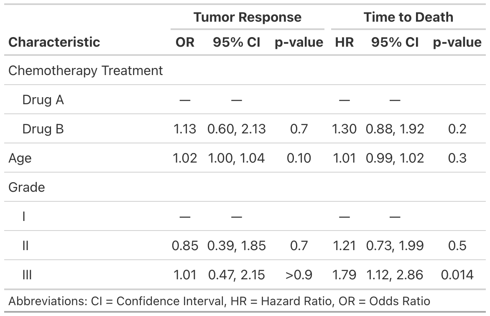
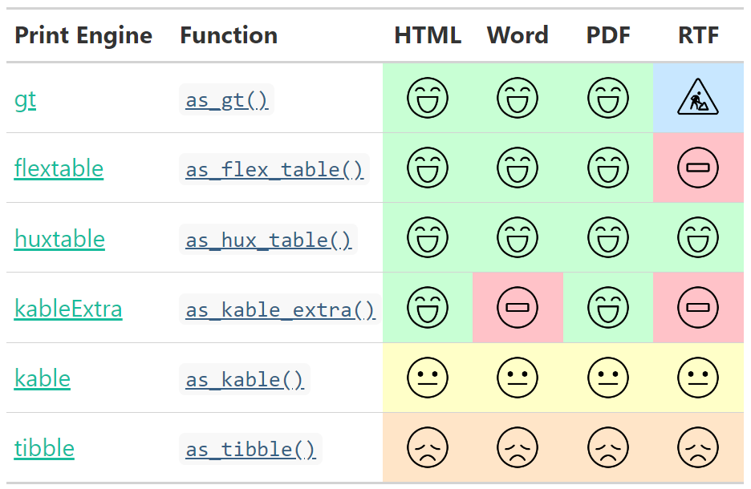

<!-- README.md is generated from README.Rmd. Please edit that file -->

<!-- badges: start -->

[](https://codecov.io/gh/ddsjoberg/gtsummary?branch=master)
[](https://github.com/ddsjoberg/gtsummary/actions)
[](https://cran.r-project.org/package=gtsummary)
[](https://cran.r-project.org/package=gtsummary)
[](https://www.tidyverse.org/lifecycle/#maturing)
<!-- badges: end -->

## gtsummary <a href='https://github.com/ddsjoberg/gtsummary'></a>

The {gtsummary} package provides an elegant and flexible way to create
publication-ready analytical and summary tables using the **R**
programming language. The {gtsummary} package summarizes data sets,
regression models, and more, using sensible defaults with highly
customizable capabilities.

  - [**Summarize data frames or
    tibbles**](http://www.danieldsjoberg.com/gtsummary/articles/tbl_summary.html)
    easily in **R**. Perfect for presenting descriptive statistics,
    comparing group **demographics** (e.g creating a **Table 1** for
    medical journals), and more. Automatically detects continuous,
    categorical, and dichotomous variables in your data set, calculates
    appropriate descriptive statistics, and also includes amount of
    missingness in each variable.

  - [**Summarize regression
    models**](http://www.danieldsjoberg.com/gtsummary/articles/tbl_regression.html)
    in R and include reference rows for categorical variables. Common
    regression models, such as logistic regression and Cox proportional
    hazards regression, are automatically identified and the tables are
    pre-filled with appropriate column headers (i.e. Odds Ratio and
    Hazard Ratio).

  - [**Customize gtsummary
    tables**](http://www.danieldsjoberg.com/gtsummary/reference/index.html#section-general-formatting-styling-functions)
    using a growing list of formatting/styling functions.
    **[Bold](http://www.danieldsjoberg.com/gtsummary/reference/bold_italicize_labels_levels.html)**
    labels,
    **[italicize](http://www.danieldsjoberg.com/gtsummary/reference/bold_italicize_labels_levels.html)**
    levels, **[add
    p-value](http://www.danieldsjoberg.com/gtsummary/reference/add_p.html)**
    to summary tables,
    **[style](http://www.danieldsjoberg.com/gtsummary/reference/style_percent.html)**
    the statistics however you choose,
    **[merge](http://www.danieldsjoberg.com/gtsummary/reference/tbl_merge.html)**
    or
    **[stack](http://www.danieldsjoberg.com/gtsummary/reference/tbl_stack.html)**
    tables to present results side by side… there are so many
    possibilities to create the table of your dreams\!

  - **[Report statistics
    inline](http://www.danieldsjoberg.com/gtsummary/articles/tbl_summary.html#inline_text)**
    from summary tables and regression summary tables in **R markdown**.
    Make your reports completely reproducible\!

By leveraging [{broom}](https://broom.tidyverse.org/),
[{gt}](https://gt.rstudio.com/), and
[{labelled}](http://larmarange.github.io/labelled/) packages,
{gtsummary} creates beautifully formatted, ready-to-share summary and
result tables in a single line of R code\!

Check out the examples below, review the
[vignettes](http://www.danieldsjoberg.com/gtsummary/articles/) for a
detailed exploration of the output options, and view the
[gallery](http://www.danieldsjoberg.com/gtsummary/articles/gallery.html)
for various customization examples.

## Installation

The {gtsummary} package was written as a companion to the
[{gt}](https://gt.rstudio.com/) package from RStudio. You can install
{gtsummary} with the following code.

``` r
install.packages("gtsummary")
```

Install the development version of {gtsummary} with:

``` r
remotes::install_github("ddsjoberg/gtsummary")
```

## Examples

### Summary Table

Use
[`tbl_summary()`](http://www.danieldsjoberg.com/gtsummary/reference/tbl_summary.html)
to summarize a data frame.


Example basic table:

``` r
library(gtsummary)
# make dataset with a few variables to summarize
trial2 <- trial %>% dplyr::select(trt, age, grade, response)

# summarize the data with our package
table1 <- tbl_summary(trial2)
```


There are many **customization options** to **add information** (like
comparing groups) and **format results** (like bold labels) in your
table. See the
[`tbl_summary()`](http://www.danieldsjoberg.com/gtsummary/articles/tbl_summary.html)
tutorial for many more options, or below for one example.

``` r
table2 <- tbl_summary(
  trial2,
  by = trt, # split table by group
  missing = "no" # don't list missing data separately
) %>%
  add_n() %>% # add column with total number of non-missing observations
  add_p() %>% # test if there's difference between groups
  bold_labels() 
```


### Regression Models

Use
[`tbl_regression()`](http://www.danieldsjoberg.com/gtsummary/reference/tbl_regression.html)
to easily and beautifully display regression model results in a table.
See the
[tutorial](http://www.danieldsjoberg.com/gtsummary/articles/tbl_regression.html)
for customization options.

``` r
mod1 <- glm(response ~ trt + age + grade, trial, family = binomial)

t1 <- tbl_regression(mod1, exponentiate = TRUE)
```


### Side-by-side Regression Models

You can also present side-by-side regression model results using
`tbl_merge()`

``` r
library(survival)

# build survival model table
t2 <-
  coxph(Surv(ttdeath, death) ~ trt + grade + age, trial) %>%
  tbl_regression(exponentiate = TRUE)

# merge tables 
tbl_merge_ex1 <-
  tbl_merge(
    tbls = list(t1, t2),
    tab_spanner = c("**Tumor Response**", "**Time to Death**")
  )
```



Review even more output options in the **[table
gallery](http://www.danieldsjoberg.com/gtsummary/articles/gallery.html)**.

## gtsummary + R Markdown

The **{gtsummary}** package was written to be a companion to the
**{gt}** package from RStudio. But not all output types are supported by
the **{gt}** package. Therefore, we have made it possible to print
**{gtsummary}** tables with various engines.

Review the **[gtsummary + R
Markdown](http://www.danieldsjoberg.com/gtsummary/dev/articles/rmarkdown.html)**
vignette for details.

<a href="http://www.danieldsjoberg.com/gtsummary/dev/articles/rmarkdown.html">
 </a>

## Contributing

Please note that the {gtsummary} project is released with a [Contributor
Code of
Conduct](http://www.danieldsjoberg.com/gtsummary/CODE_OF_CONDUCT.html).
By contributing to this project, you agree to abide by its terms. A big
thank you to all contributors\!  
[@ablack3](https://github.com/ablack3),
[@ahinton-mmc](https://github.com/ahinton-mmc),
[@davidkane9](https://github.com/davidkane9),
[@ddsjoberg](https://github.com/ddsjoberg),
[@emilyvertosick](https://github.com/emilyvertosick),
[@jeanmanguy](https://github.com/jeanmanguy),
[@jennybc](https://github.com/jennybc),
[@jflynn264](https://github.com/jflynn264),
[@jwilliman](https://github.com/jwilliman),
[@karissawhiting](https://github.com/karissawhiting),
[@leejasme](https://github.com/leejasme),
[@ltin1214](https://github.com/ltin1214),
[@margarethannum](https://github.com/margarethannum),
[@michaelcurry1123](https://github.com/michaelcurry1123),
[@MyKo101](https://github.com/MyKo101),
[@oranwutang](https://github.com/oranwutang),
[@ryzhu75](https://github.com/ryzhu75),
[@sammo3182](https://github.com/sammo3182),
[@slobaugh](https://github.com/slobaugh),
[@tormodb](https://github.com/tormodb), and
[@zabore](https://github.com/zabore)
