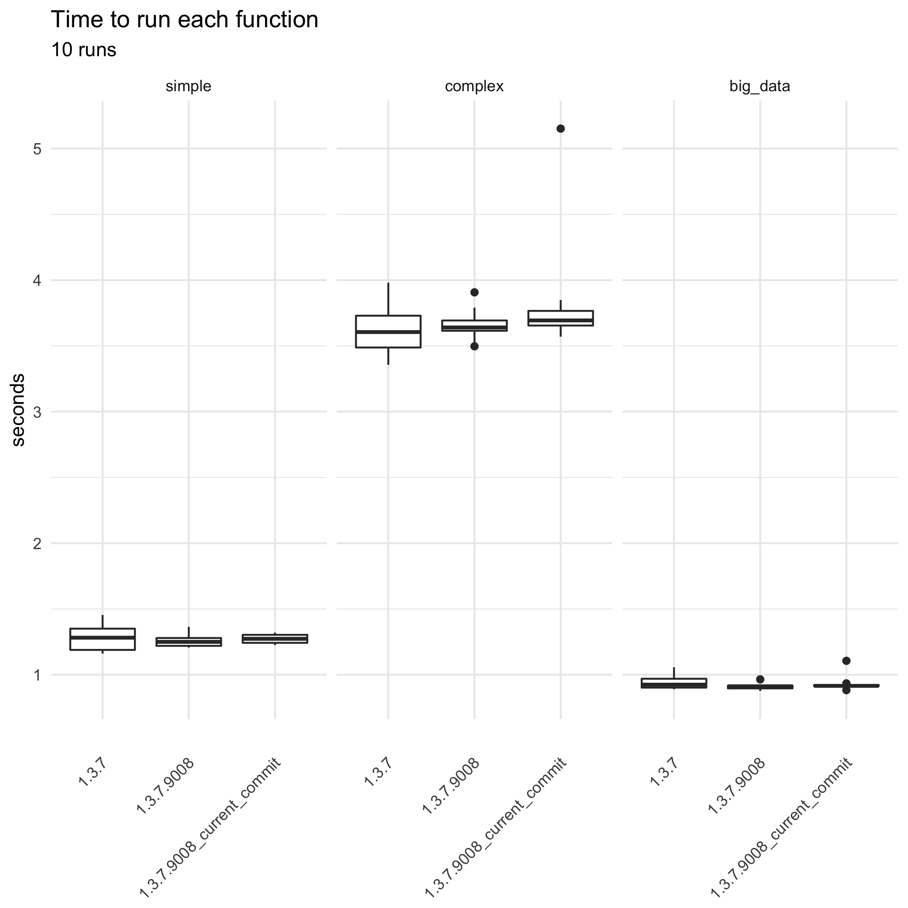
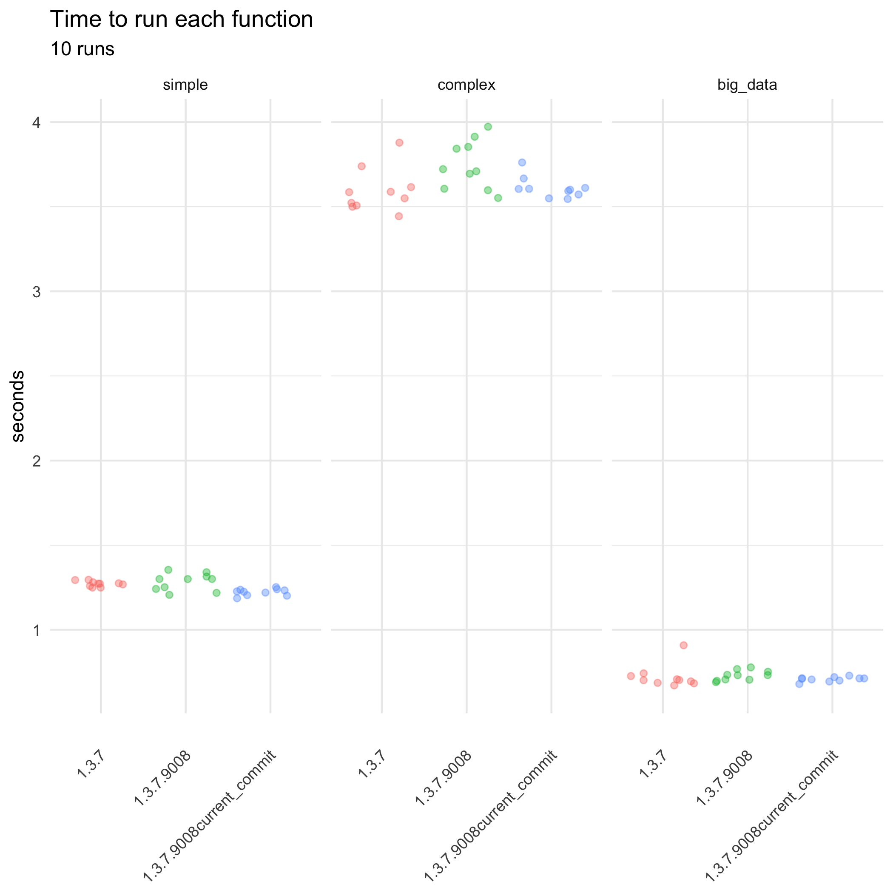

{gtsummary} benchmark
================
March 12, 2021

<!-- README.md is generated from README.Rmd. Please edit that file -->
<!-- This css stuff is just to enable rmarkdown to use a wider area of screen -->
<!--  -->

## Execution times

The functions used for the benchmark are:

`simple = tbl_summary(trial)`

`complex = tbl_summary(trial, by = trt) %>% add_overall() %>% add_p() %>% add_q(quiet = TRUE) %>% add_n()`

`big_data = big_trial %>% select(age, grade, trt) %>% tbl_summary(by = trt, missing = "no") %>% add_p()`
(NOTE: `big_trial` is a 5000-fold copy of `gtsummary::trial`)
