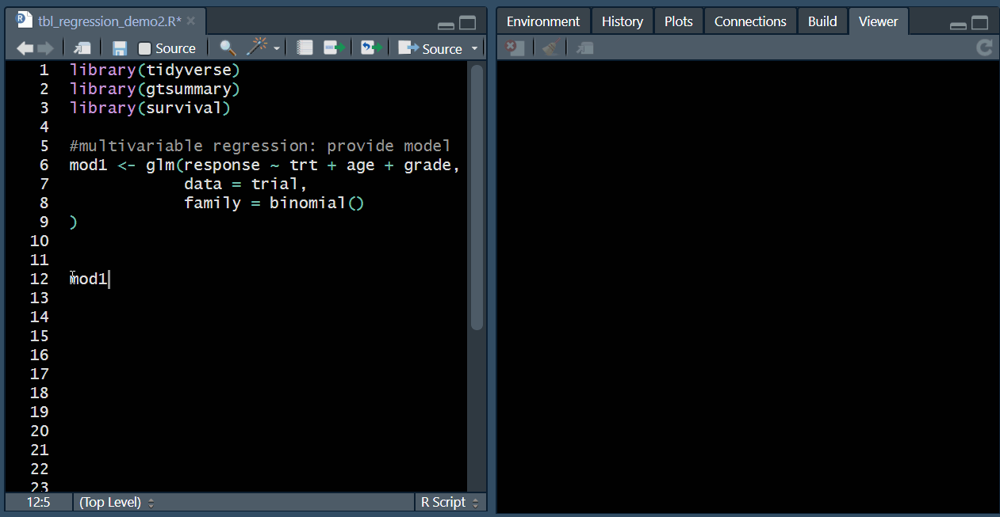

```{r setup, include = FALSE}
knitr::opts_chunk$set(
  collapse = TRUE,
  comment = "#>"
)
```

<!-- Not creating vignette if gt is not installed. -->
`r if(!requireNamespace("gt")){"The system this vignette was built on did not have the required {gt} package installed. Please visit the package website for the full vignette. http://www.danieldsjoberg.com/gtsummary/articles/tbl_regression.html"}`

```{r exit_early, include = FALSE, eval = !requireNamespace("gt")}
knitr::knit_exit()
```

<!-- Start of vignette -->
## Introduction

The [`tbl_regression()`](http://www.danieldsjoberg.com/gtsummary/dev/reference/tbl_regression.html) function takes a **regression model object** in **R** and returns a **formatted table of regression model results** that is publication-ready. It is a simple way to summarize and present your analysis results using **R**! Like [`tbl_summary()`](http://www.danieldsjoberg.com/gtsummary/dev/reference/tbl_summary.html), `tbl_regression()` creates highly customizable analytic tables with sensible defaults. 

This vignette will walk a reader through the `tbl_regression()` function, and the various functions available to modify and make additions to an existing formatted regression table. 



*Behind the scenes:* `tbl_regression()` uses `broom::tidy()` to perform the initial model formatting, and can accommodate many different model types (e.g. `lm()`, `glm()`, `survival::coxph()`, `survival::survreg()` and more are [vetted tidy models](http://www.danieldsjoberg.com/gtsummary/reference/tidy_vetted.html) that are known to work with our package). It is also possible to specify your own function to tidy the model results if needed.  

To start, a quick note on the {magrittr} package's **pipe function**, **`%>%`**.  By default the pipe operator puts whatever is on the left hand side of `%>%` into the first argument of the function on the right hand side.  The pipe function can be used to make the code relating to `tbl_regression()` easier to use, but it is *not* required.  Here are a few examples of how `%>%` translates into typical R notation.

    x %>% f() is equivalent to f(x)
    x %>% f(y) is equivalent to f(x, y)
    y %>% f(x, .) is equivalent to f(x, y)
    z %>% f(x, y, arg = .) is equivalent to f(x, y, arg = z)

## Setup

Before going through the tutorial, install {gtsummary} and {gt}.

```{r, include=FALSE}
library(gtsummary)
library(dplyr)
```

```{r, eval=FALSE}
install.packages("gtsummary")
remotes::install_github("rstudio/gt", ref = gtsummary::gt_sha)

library(gtsummary)
library(dplyr)
```

- If you experience issues installing {gt} on Windows, install [Rtools from CRAN](https://cran.r-project.org/bin/windows/Rtools/), restart R, and attempt installation again.

## Example data set

In this vignette we'll be using the [**`trial`**](http://www.danieldsjoberg.com/gtsummary/reference/trial.html) data set which is included in the {gtsummary package}.

* This data set contains information from `r nrow(trial)` patients who received one of two types of chemotherapy (Drug A or Drug B).

* The outcomes are tumor response and death.  

* Each variable in the data frame has been assigned an **attribute label** (i.e. `attr(trial$trt, "label") == "Chemotherapy Treatment")` with the **[labelled](http://larmarange.github.io/labelled/)** package, which we highly recommend using. These labels are displayed in the {gtsummary} output table by default. Using {gtsummary} on a data frame without labels will simply print variable names, or there is an option to add labels later.


        trt      Chemotherapy Treatment
        age      Age, yrs
        marker   Marker Level, ng/mL
        stage    T Stage
        grade    Grade
        response Tumor Response
        death    Patient Died
        ttdeath  Years from Treatment to Death/Censor
        
    

## Basic Usage

The default output from `tbl_regression()` is meant to be publication ready.  

* Let's start by creating a **logistic regression model** to **predict tumor response** using the variables age, stage, and grade from the [`trial`](http://www.danieldsjoberg.com/gtsummary/reference/trial.html) data set. 
```{r, message=FALSE}
# build logistic regression model
m1 = glm(response ~ age + stage + grade, trial, family = binomial(link = "logit"))

# view raw model results
summary(m1)$coefficients

```

* We will then a **regression model table** to summarize and present these results in just one line of code from {gtsummary}. 

```{r, message=FALSE}
# format results
tbl_regression(m1, exponentiate = TRUE)
```

  

Note the sensible defaults with this basic usage (that can be customized later):

* The model was recognized as logistic regression with coefficients exponentiated, so the **header displayed "OR"** for odds ratio. 

* **Variable types** are automatically detected and **reference rows** are created for categorical variables.

* **Model estimates** and **confidence intervals** are **rounded** and nicely formatted.

* P-values above 0.9 are presented as ">0.9" and below 0.001 are presented as "<0.001". Non-significant p-values are only rounded to one decimal, while those close to or below the significance threshold (default 0.05) have additional decimal places by default.

* Because the variables in the data set were [labelled](http://larmarange.github.io/labelled/), the **labels were carried through** into the {gtsummary} output table.  Had the data not been labelled, the default is to display the variable name.

* Variable levels are **indented** and **footnotes** are added if printed using [{gt}](https://gt.rstudio.com/). (can alternatively be printed using `knitr::kable()`; see options [here](http://www.danieldsjoberg.com/gtsummary/articles/global_options.html#printing))

## Customize Output

There are four primary ways to customize the output of the regression model table.

1. Modify `tbl_regression()` function input arguments
1. Add additional data/information to a summary table with `add_*()` functions
1. Modify summary table appearance with the {gtsummary} functions
1. Modify table appearance with {gt} package functions

### Modifying function arguments

The `tbl_regression()` function includes many input options for modifying the appearance.

    label         modify the variable labels printed in the table.  
    exponentiate  exponentiate model coefficients.  
    include       names of variables to include in output. Default is all variables.  
    show_single_row    By default, categorical variables are printed on multiple rows.  If a variable is dichotomous (e.g. Yes/No) and you wish to print the regression coefficient on a single row, include the variable name(s) here. 
    conf.level    confidence level of confidence interval.  
    intercept     logical argument indicates whether to include the intercept in output.  
    estimate_fun  function to round and format coefficient estimates.  
    pvalue_fun    function to round and format p-values.  
    tidy_fun      function to specify/customize tidier function

### {gtsummary} functions to add information

The {gtsummary} package has built-in functions for adding to results from `tbl_regression()`.  The following functions add columns and/or information to the regression table.

    add_global_p()  adds the global p-value for a categorical variables   
    add_nevent()    adds the number of observed events to the results object    

### {gtsummary} functions to format table

The {gtsummary} package comes with functions specifically made to modify and format summary tables.  

    bold_labels()       bold variable labels  
    bold_levels()       bold variable levels  
    italicize_labels()  italicize variable labels  
    italicize_levels()  italicize variable levels  
    bold_p()            bold significant p-values  

### {gt} functions to format table

The {gt} package is packed with many great functions for modifying table output---too many to list here.  Review the package's website for a full listing. https://gt.rstudio.com/index.html

To use the {gt} package functions with {gtsummary} tables, the regression table must first be converted into a {gt} object.  To this end, use the `as_gt()` function after modifications have been completed with {gtsummary} functions.

```
m1 %>%
  tbl_regression(exponentiate = TRUE) %>%
  as_gt() %>%
  <gt functions>
```
### Example

There are formatting options available, such as adding bold and italics to text.  In the example below,  
- Variable labels are **bold**  
- Levels of categorical levels are *italicized*  
- **Global p-values** for T Stage and Grade are reported
- P-values less than 0.10 are **bold** 
- Large p-values are rounded to **two decimal places**  
- Coefficients are **exponentiated** to give odds ratios  
- Odds ratios are rounded to 2 or 3 significant figures

```{r, message=FALSE}
# format results into data frame with global p-values
m1 %>%
  tbl_regression(
    exponentiate = TRUE, 
    pvalue_fun = function(x) style_pvalue(x, digits = 2),
    estimate_fun = function(x) style_ratio(x, digits = 3)
  ) %>% 
  add_global_p() %>%
  bold_p(t = 0.10) %>%
  bold_labels() %>% 
  italicize_levels()
```


## Advanced Customization {#advanced}

When you print the output from the `tbl_regression()` function into the R console or into an R markdown, there are default printing functions that are called in the background: `print.tbl_regression()` and `knit_print.tbl_regression()`.  The true output from `tbl_regression()` is a named list, but when you print the object, a formatted version of `.$table_body` is displayed.  All formatting and modifications are made using the {gt} package by default.

```{r}
tbl_regression(m1) %>% names()
```

These are the additional data stored in the `tbl_regression()` output list. 

    table_body   data frame with summary statistics  
    n            N included in model  
    model_obj    the model object passed to `tbl_regression`  
    call_list    named list of each function called on the `tbl_regression` object  
    inputs       inputs from the `tbl_regression()` function call  
    gt_calls     named list of {gt} function calls  
    kable_calls  named list of function calls to be applied before knitr::kable()  

`gt_calls` is a named list of saved {gt} function calls.  The {gt} calls are run when the object is printed to the console or in an R markdown document. Here's an example of the first few calls saved with `tbl_regression()`:

```{r}
tbl_regression(m1) %>% purrr::pluck("gt_calls") %>% head(n = 5)
```

The {gt} functions are called in the order they appear, always beginning with the `gt()` function.

If the user does not want a specific {gt} function to run, any {gt} call can be excluded in the `as_gt()` function.
For example, the `tbl_regression()` call creates many named {gt} function calls: *`r tbl_regression(m1) %>% purrr::pluck("gt_calls") %>% names() %>% paste(collapse = ", ")`*.
Any one of these can be excluded.  In this example, the default footnote will be excluded from the output.

```{r as_gt2, eval=FALSE}
tbl_regression(m1, exponentiate = TRUE) %>%
  as_gt(include = -tab_footnote)
```

```{r as_gt1, echo=FALSE}
# this code chunk only works if gt is installed
if (requireNamespace("gt", quietly = TRUE)) {
  tbl_regression(m1, exponentiate = TRUE) %>%
    as_gt(include = -tab_footnote)
}
```

## Univariate Regression {#tbl_uvregression}

The `tbl_uvregression()` produces a table of univariate regression results.  The function is a wrapper for `tbl_regression()`, and as a result, accepts nearly identical function arguments.  The function's results can be modified in similar ways to `tbl_regression()` and the results reported inline similarly to `tbl_regression()`.


```{r tbl_uvregression}
trial %>%
  select(-death, -ttdeath, -stage) %>%
  tbl_uvregression(
    method = glm,
    y = response,
    method.args = list(family = binomial),
    exponentiate = TRUE,
    pvalue_fun = function(x) style_pvalue(x, digits = 2)
  ) %>%
  # overrides the default that shows p-values for each level
  add_global_p() %>%
  # adjusts global p-values for multiple testing (default method: FDR)
  add_q() %>%
  # bold p-values under a given threshold (default 0.05)
  bold_p() %>%
  # now bold q-values under the threshold of 0.10
  bold_p(t = 0.10, q = TRUE) %>%
  bold_labels()
```

## Setting Default Options {#options}

The {gtsummary} regression functions and their related functions have sensible defaults for rounding and formatting results.  If you, however, would like to change the defaults there are a few options.  The default options can be changed in a single script with addition an `options()` command in the script.  The defaults can also be set on the project- or user-level R profile, `.Rprofile`.

```{r, eval=FALSE}
help("Rprofile")

usethis::edit_r_profile()
```

The following parameters are available to be set:

```{r, echo=FALSE}
data.frame(
  `Description` = c("Formatting and rounding p-values", 
                    "Formatting and rounding for regression coefficients",
                    "Set level for limits",
                    "Print tables with `gt` or `kable`"),
  `Example` = c("`options(gtsummary.pvalue_fun = function(x) gtsummary::style_pvalue(x, digits = 2))`",
                '`options(gtsummary.tbl_regression.estimate_fun = function(x) gtsummary::style_sigfig(x, digits = 3))`',
                '`options(gtsummary.conf.level = 0.90)`',
                '`options(gtsummary.print_engine = "kable")`   `options(gtsummary.print_engine = "gt")`'),
  `Functions` = c("`add_p()`, `tbl_regression()`, `tbl_uvregression()`",
                  "`tbl_regression()`, `tbl_uvregression()`",
                  "`tbl_regression()`, `tbl_uvregression()`",
                  "All `tbl_*()` functions")
) %>% 
  knitr::kable()
```

When setting default rounding/formatting functions, set the default to a function object rather than an evaluated function.  For example, if you want to round estimates to 3 significant figures use,

```{r,eval=FALSE}
options(gtsummary.tbl_regression.estimate_fun = function(x) sigfig(x, digits = 3))
```

